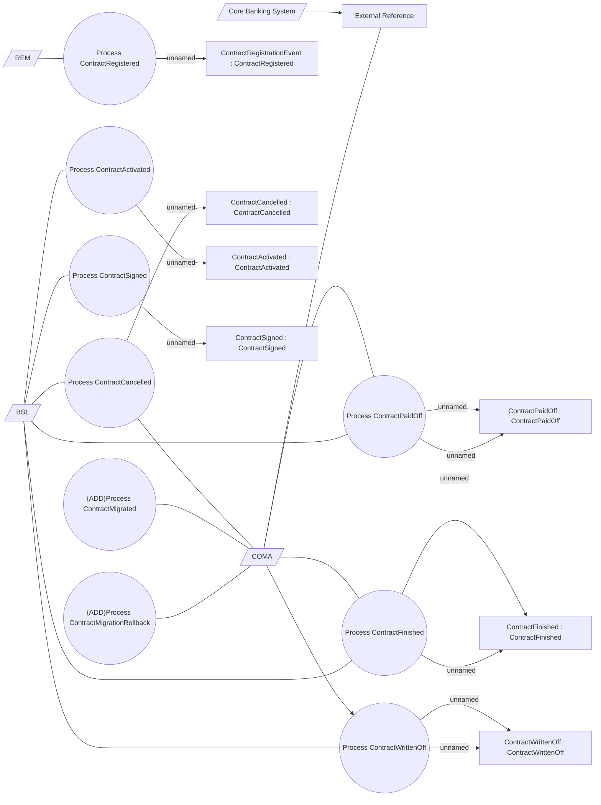

# Messages processing

- **Diagram Type**: Use Case
- **Package**: HomerSelect/BSL/Analysis Model/Contract Management/COMMON for Contract Management/Messages processing/Use Case model
- **Diagram ID**: 164548
- **Elements**: 25
- **Connectors**: 25

