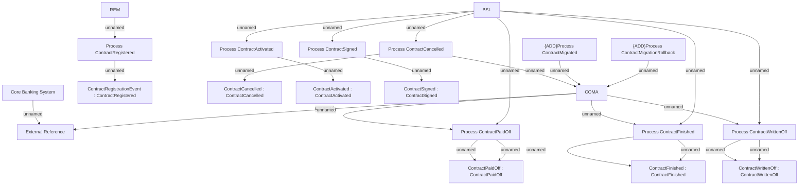

# Messages processing

```mermaid
graph TD
    ADD_Process_ContractMigrationRollback["{ADD}Process ContractMigrationRollback"]
    ADD_Process_ContractMigrated["{ADD}Process ContractMigrated"]
    External_Reference["External Reference"]
    Core_Banking_System["Core Banking System"]
    ContractRegistrationEvent_ContractRegistered["ContractRegistrationEvent : ContractRegistered"]
    Process_ContractRegistered["Process ContractRegistered
"]
    REM["REM"]
    ContractCancelled_ContractCancelled["ContractCancelled : ContractCancelled"]
    ContractActivated_ContractActivated["ContractActivated : ContractActivated"]
    ContractSigned_ContractSigned["ContractSigned : ContractSigned"]
    ContractFinished_ContractFinished["ContractFinished : ContractFinished"]
    ContractWrittenOff_ContractWrittenOff["ContractWrittenOff : ContractWrittenOff"]
    ContractPaidOff_ContractPaidOff["ContractPaidOff : ContractPaidOff"]
    ContractFinished_ContractFinished["ContractFinished : ContractFinished"]
    Process_ContractCancelled["Process ContractCancelled"]
    Process_ContractFinished["Process ContractFinished"]
    BSL["BSL"]
    Process_ContractActivated["Process ContractActivated"]
    Process_ContractSigned["Process ContractSigned"]
    ContractWrittenOff_ContractWrittenOff["ContractWrittenOff : ContractWrittenOff"]
    ContractPaidOff_ContractPaidOff["ContractPaidOff : ContractPaidOff"]
    Process_ContractWrittenOff["Process ContractWrittenOff"]
    Process_ContractPaidOff["Process ContractPaidOff"]
    COMA["COMA"]
    External_Reference["External Reference"]
    Process_ContractRegistered -->|unnamed| ContractRegistrationEvent_ContractRegistered
    Process_ContractCancelled -->|unnamed| ContractCancelled_ContractCancelled
    Process_ContractActivated -->|unnamed| ContractActivated_ContractActivated
    Process_ContractSigned -->|unnamed| ContractSigned_ContractSigned
    Process_ContractFinished -->|unnamed| ContractFinished_ContractFinished
    Process_ContractWrittenOff -->|unnamed| ContractWrittenOff_ContractWrittenOff
    Process_ContractPaidOff -->|unnamed| ContractPaidOff_ContractPaidOff
    Process_ContractFinished -->|unnamed| ContractFinished_ContractFinished
    ADD_Process_ContractMigrationRollback -->|unnamed| COMA
    Process_ContractWrittenOff -->|unnamed| ContractWrittenOff_ContractWrittenOff
    Process_ContractPaidOff -->|unnamed| ContractPaidOff_ContractPaidOff
    ADD_Process_ContractMigrated -->|unnamed| COMA
    Process_ContractCancelled -->|unnamed| COMA
    BSL -->|unnamed| Process_ContractFinished
    BSL -->|unnamed| Process_ContractSigned
    BSL -->|unnamed| Process_ContractPaidOff
    BSL -->|unnamed| Process_ContractCancelled
    BSL -->|unnamed| Process_ContractWrittenOff
    BSL -->|unnamed| Process_ContractActivated
    COMA -->|unnamed| External_Reference
    COMA -->|unnamed| Process_ContractPaidOff
    COMA -->|unnamed| Process_ContractWrittenOff
    COMA -->|unnamed| Process_ContractFinished
    REM -->|unnamed| Process_ContractRegistered
    Core_Banking_System -->|unnamed| External_Reference
```
