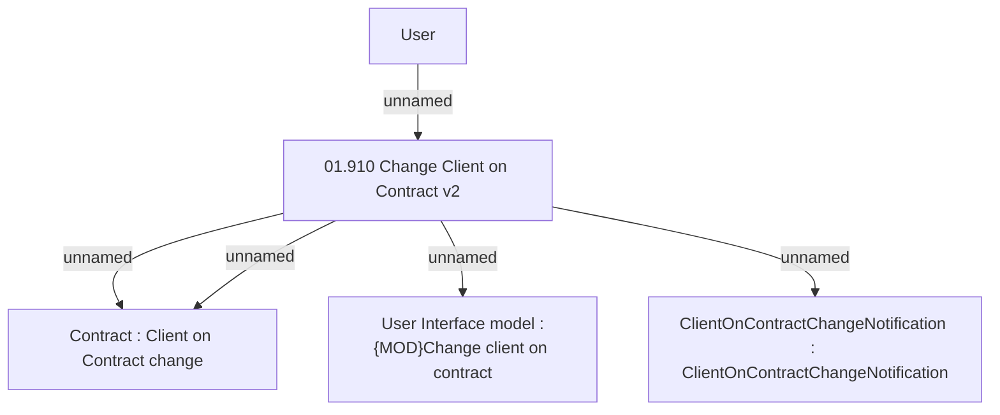

# Change of Client on contract

```mermaid
graph TD
    Contract_Client_on_Contract_change["Contract : Client on Contract change"]
    Contract_Client_on_Contract_change["Contract : Client on Contract change"]
    ClientOnContractChangeNotification_ClientOnContractChangeNot["ClientOnContractChangeNotification : ClientOnContractChangeNotification"]
    n_01_910_Change_Client_on_Contract_v2["01.910 Change Client on Contract v2"]
    User_Interface_model_MOD_Change_client_on_contract["User Interface model :{MOD}Change client on contract"]
    User["User"]
    n_01_910_Change_Client_on_Contract_v2 -->|unnamed| Contract_Client_on_Contract_change
    n_01_910_Change_Client_on_Contract_v2 -->|unnamed| User_Interface_model_MOD_Change_client_on_contract
    n_01_910_Change_Client_on_Contract_v2 -->|unnamed| ClientOnContractChangeNotification_ClientOnContractChangeNot
    n_01_910_Change_Client_on_Contract_v2 -->|unnamed| Contract_Client_on_Contract_change
    User -->|unnamed| n_01_910_Change_Client_on_Contract_v2
```
