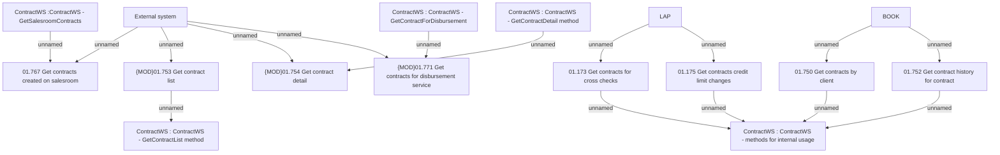

# Provide contract information

```mermaid
graph TD
    n_01_175_Get_contracts_credit_limit_changes["01.175 Get contracts credit limit changes"]
    ContractWS_ContractWS_GetSalesroomContracts["ContractWS :ContractWS - GetSalesroomContracts"]
    n_01_767_Get_contracts_created_on_salesroom["01.767 Get contracts created on salesroom"]
    ContractWS_ContractWS_GetContractDetail_method["ContractWS : ContractWS - GetContractDetail method"]
    ContractWS_ContractWS_GetContractForDisbursement["ContractWS : ContractWS - GetContractForDisbursement"]
    MOD_01_771_Get_contracts_for_disbursement_service["{MOD}01.771 Get contracts for disbursement service"]
    ContractWS_ContractWS_GetContractList_method["ContractWS : ContractWS - GetContractList method"]
    ContractWS_ContractWS_methods_for_internal_usage["ContractWS : ContractWS - methods for internal usage"]
    External_system["External system"]
    BOOK["BOOK"]
    LAP["LAP"]
    MOD_01_754_Get_contract_detail["{MOD}01.754 Get contract detail"]
    MOD_01_753_Get_contract_list["{MOD}01.753 Get contract list"]
    n_01_752_Get_contract_history_for_contract["01.752 Get contract history for contract"]
    n_01_750_Get_contracts_by_client["01.750 Get contracts by client"]
    n_01_173_Get_contracts_for_cross_checks["01.173 Get contracts for cross checks"]
    n_01_750_Get_contracts_by_client -->|unnamed| ContractWS_ContractWS_methods_for_internal_usage
    ContractWS_ContractWS_GetSalesroomContracts -->|unnamed| n_01_767_Get_contracts_created_on_salesroom
    ContractWS_ContractWS_GetContractForDisbursement -->|unnamed| MOD_01_771_Get_contracts_for_disbursement_service
    MOD_01_753_Get_contract_list -->|unnamed| ContractWS_ContractWS_GetContractList_method
    n_01_752_Get_contract_history_for_contract -->|unnamed| ContractWS_ContractWS_methods_for_internal_usage
    n_01_173_Get_contracts_for_cross_checks -->|unnamed| ContractWS_ContractWS_methods_for_internal_usage
    ContractWS_ContractWS_GetContractDetail_method -->|unnamed| MOD_01_754_Get_contract_detail
    n_01_175_Get_contracts_credit_limit_changes -->|unnamed| ContractWS_ContractWS_methods_for_internal_usage
    LAP -->|unnamed| n_01_175_Get_contracts_credit_limit_changes
    LAP -->|unnamed| n_01_173_Get_contracts_for_cross_checks
    External_system -->|unnamed| MOD_01_771_Get_contracts_for_disbursement_service
    External_system -->|unnamed| MOD_01_754_Get_contract_detail
    External_system -->|unnamed| MOD_01_753_Get_contract_list
    External_system -->|unnamed| n_01_767_Get_contracts_created_on_salesroom
    BOOK -->|unnamed| n_01_752_Get_contract_history_for_contract
    BOOK -->|unnamed| n_01_750_Get_contracts_by_client
```
