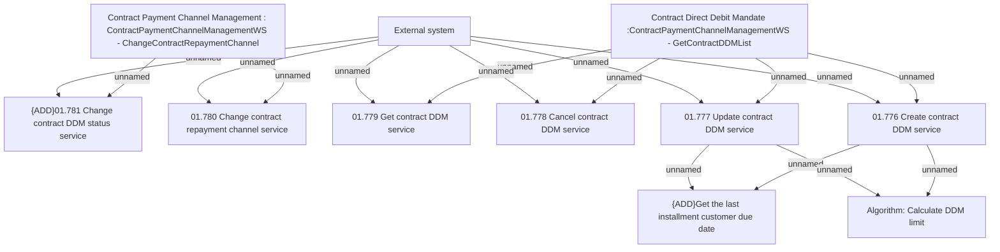

# Contract DDM operations

```mermaid
graph TD
    Contract_Payment_Channel_Management_ContractPaymentChannelMa["Contract Payment Channel Management : ContractPaymentChannelManagementWS - ChangeContractDDMStatus"]
    ADD_01_781_Change_contract_DDM_status_service["{ADD}01.781 Change contract DDM status service"]
    ADD_Get_the_last_installment_customer_due_date["{ADD}Get the last installment customer due date"]
    Algorithm_Calculate_DDM_limit["Algorithm: Calculate DDM limit"]
    Contract_Payment_Channel_Management_ContractPaymentChannelMa["Contract Payment Channel Management : ContractPaymentChannelManagementWS - ChangeContractRepaymentChannel"]
    n_01_780_Change_contract_repayment_channel_service["01.780 Change contract repayment channel service"]
    Contract_Direct_Debit_Mandate_ContractPaymentChannelManageme["Contract Direct Debit Mandate :ContractPaymentChannelManagementWS - UpdateContractDDM"]
    Contract_Direct_Debit_Mandate_ContractPaymentChannelManageme["Contract Direct Debit Mandate :ContractPaymentChannelManagementWS - CreateContractDDM API"]
    Contract_Direct_Debit_Mandate_ContractPaymentChannelManageme["Contract Direct Debit Mandate :ContractPaymentChannelManagementWS - CancelContractDDM"]
    Contract_Direct_Debit_Mandate_ContractPaymentChannelManageme["Contract Direct Debit Mandate :ContractPaymentChannelManagementWS - GetContractDDMList"]
    External_system["External system"]
    n_01_779_Get_contract_DDM_service["01.779 Get contract DDM service"]
    n_01_778_Cancel_contract_DDM_service["01.778 Cancel contract DDM service"]
    n_01_777_Update_contract_DDM_service["01.777 Update contract DDM service"]
    n_01_776_Create_contract_DDM_service["01.776 Create contract DDM service"]
    Contract_Payment_Channel_Management_ContractPaymentChannelMa -->|unnamed| ADD_01_781_Change_contract_DDM_status_service
    n_01_776_Create_contract_DDM_service -->|unnamed| ADD_Get_the_last_installment_customer_due_date
    n_01_777_Update_contract_DDM_service -->|unnamed| ADD_Get_the_last_installment_customer_due_date
    n_01_776_Create_contract_DDM_service -->|unnamed| Algorithm_Calculate_DDM_limit
    n_01_777_Update_contract_DDM_service -->|unnamed| Algorithm_Calculate_DDM_limit
    Contract_Direct_Debit_Mandate_ContractPaymentChannelManageme -->|unnamed| n_01_779_Get_contract_DDM_service
    Contract_Direct_Debit_Mandate_ContractPaymentChannelManageme -->|unnamed| n_01_778_Cancel_contract_DDM_service
    Contract_Direct_Debit_Mandate_ContractPaymentChannelManageme -->|unnamed| n_01_777_Update_contract_DDM_service
    Contract_Direct_Debit_Mandate_ContractPaymentChannelManageme -->|unnamed| n_01_776_Create_contract_DDM_service
    Contract_Payment_Channel_Management_ContractPaymentChannelMa -->|unnamed| n_01_780_Change_contract_repayment_channel_service
    External_system -->|unnamed| n_01_779_Get_contract_DDM_service
    External_system -->|unnamed| n_01_778_Cancel_contract_DDM_service
    External_system -->|unnamed| n_01_780_Change_contract_repayment_channel_service
    External_system -->|unnamed| n_01_776_Create_contract_DDM_service
    External_system -->|unnamed| n_01_777_Update_contract_DDM_service
    External_system -->|unnamed| ADD_01_781_Change_contract_DDM_status_service
```
