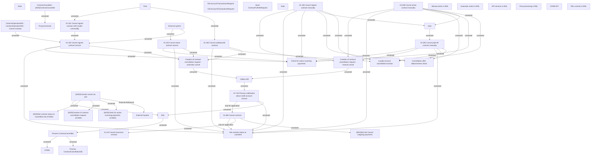

# Cancel contract after sign

```mermaid
graph TD
    ContractOperationWS_ContractOperationWS_Cancel_contract["ContractOperationWS : ContractOperationWS - Cancel contract"]
    el_1850491["Note"]
    n_01_740_Process_notification_about_credit_account_closure["01.740 Process notification about credit account closure "]
    CaBus_AM["CaBus-AM"]
    ProxyConnector["ProxyConnector"]
    BSL["BSL"]
    ContractCancelled_ADD_ContractCancelled["ContractCancelled : {ADD}ContractCancelled"]
    ADD_Set_contract_status_to_Cancelled_rule_COMA["{ADD}Set contract status to Cancelled rule (COMA)"]
    ADD_Creation_of_contract_cancellation_request_COMA["{ADD}Creation of contract cancellation request (COMA)"]
    ADD_Check_for_active_incoming_payments_COMA["{ADD}Check for active incoming payments (COMA)"]
    ADD_Contract_cancel_via_API["{ADD}Contract cancel via API"]
    User["User"]
    Time["Time"]
    External_system["External system"]
    External_System["External System"]
    MOD_05_240_Cancel_outgoing_payments["{MOD}05.240 Cancel outgoing payments"]
    n_11_110_Cancel_insurance_contract["11.110 Cancel insurance contract"]
    CELAccountTransactionsRequest_CELAccountTransactionsRequest["CELAccountTransactionsRequest : CELAccountTransactionsRequest"]
    Send_ContractFullInfoRequest["Send ContractFullInfoRequest"]
    Loyalty_account_cancellation_function["Loyalty account cancellation function"]
    el_1850516["Note"]
    Creation_of_contract_cancellation_request_automatic_cancel["Creation of contract cancellation request - automatic cancel"]
    BSL["BSL"]
    COMA["COMA"]
    Process_ContractCancelled["Process ContractCancelled"]
    Process_ContractCancellationSE["Process ContractCancellationSE"]
    ContractCancelled_ADD_ContractCancelled["ContractCancelled : {ADD}ContractCancelled"]
    Set_contract_status_to_canceled["Set contract status to canceled"]
    Creation_of_contract_cancellation_request_manual_cancel["Creation of contract cancellation request - manual cancel"]
    Check_for_active_incoming_payments["Check for active incoming payments"]
    Cancellation_after_disbursement_check["Cancellation after disbursement check"]
    n_01_331_Cancel_signed_contract_with_invalid_commodity["01.331 Cancel signed contract with invalid commodity"]
    n_01_332_Cancel_signed_contract_service["01.332 Cancel signed contract service"]
    n_01_333_Cancel_active_contract_service["01.333 Cancel active contract service"]
    n_01_592_Cancel_paid_off_contract_manually["01.592 Cancel paid-off contract manually"]
    n_01_445_Cancel_undisbursed_contract["01.445 Cancel undisbursed contract"]
    n_01_590_Cancel_active_contract_manually["01.590 Cancel active contract manually"]
    n_01_330_Cancel_signed_contract_manually["01.330 Cancel signed contract manually"]
    n_01_360_Cancel_contract["01.360 Cancel contract"]
    Manual_action_in_BSL["Manual action in BSL"]
    Automatic_action_in_BSL["Automatic action in BSL"]
    API_services_in_BSL["API services in BSL"]
    Post_processing_in_BSL["Post processing in BSL"]
    COMA_API["COMA API"]
    REL_contract_in_BSL["REL contract in BSL"]
    n_01_360_Cancel_contract -->|unnamed| MOD_05_240_Cancel_outgoing_payments
    n_01_332_Cancel_signed_contract_service -->|unnamed| Creation_of_contract_cancellation_request_automatic_cancel
    n_01_445_Cancel_undisbursed_contract -->|unnamed| Creation_of_contract_cancellation_request_automatic_cancel
    n_01_333_Cancel_active_contract_service -->|unnamed| Creation_of_contract_cancellation_request_automatic_cancel
    n_01_590_Cancel_active_contract_manually -->|unnamed| Loyalty_account_cancellation_function
    n_01_330_Cancel_signed_contract_manually -->|unnamed| Loyalty_account_cancellation_function
    n_01_445_Cancel_undisbursed_contract -->|unnamed| Loyalty_account_cancellation_function
    n_01_592_Cancel_paid_off_contract_manually -->|unnamed| Loyalty_account_cancellation_function
    n_01_360_Cancel_contract -->|unnamed| n_11_110_Cancel_insurance_contract
    n_01_333_Cancel_active_contract_service -->|unnamed| Set_contract_status_to_canceled
    ADD_Contract_cancel_via_API -->|External Reference| External_System
    n_01_590_Cancel_active_contract_manually -->|unnamed| User
    n_01_330_Cancel_signed_contract_manually -->|unnamed| User
    ADD_Contract_cancel_via_API -->|unnamed| ADD_Check_for_active_incoming_payments_COMA
    ADD_Contract_cancel_via_API -->|unnamed| ADD_Creation_of_contract_cancellation_request_COMA
    ADD_Contract_cancel_via_API -->|unnamed| ADD_Set_contract_status_to_Cancelled_rule_COMA
    n_01_740_Process_notification_about_credit_account_closure -->|unnamed| BSL
    ADD_Contract_cancel_via_API -->|unnamed| BSL
    ContractCancelled_ADD_ContractCancelled -->|unnamed| ProxyConnector
    Creation_of_contract_cancellation_request_manual_cancel -->|unnamed| CaBus_AM
    Creation_of_contract_cancellation_request_automatic_cancel -->|unnamed| CaBus_AM
    n_01_590_Cancel_active_contract_manually -->|unnamed| Check_for_active_incoming_payments
    ContractOperationWS_ContractOperationWS_Cancel_contract -->|unnamed| n_01_332_Cancel_signed_contract_service
    n_01_331_Cancel_signed_contract_with_invalid_commodity -->|unnamed| n_01_332_Cancel_signed_contract_service
    n_01_592_Cancel_paid_off_contract_manually -->|unnamed| Cancellation_after_disbursement_check
    n_01_330_Cancel_signed_contract_manually -->|unnamed| Cancellation_after_disbursement_check
    n_01_590_Cancel_active_contract_manually -->|unnamed| Cancellation_after_disbursement_check
    n_01_330_Cancel_signed_contract_manually -->|unnamed| Check_for_active_incoming_payments
    n_01_740_Process_notification_about_credit_account_closure -->|unnamed| Set_contract_status_to_canceled
    n_01_332_Cancel_signed_contract_service -->|unnamed| Set_contract_status_to_canceled
    n_01_592_Cancel_paid_off_contract_manually -->|unnamed| Set_contract_status_to_canceled
    n_01_360_Cancel_contract -->|only for application| Set_contract_status_to_canceled
    n_01_590_Cancel_active_contract_manually -->|unnamed| Set_contract_status_to_canceled
    n_01_332_Cancel_signed_contract_service -->|unnamed| Check_for_active_incoming_payments
    n_01_330_Cancel_signed_contract_manually -->|unnamed| Set_contract_status_to_canceled
    n_01_740_Process_notification_about_credit_account_closure -->|only for application| n_01_360_Cancel_contract
    n_01_590_Cancel_active_contract_manually -->|unnamed| Creation_of_contract_cancellation_request_manual_cancel
    n_01_592_Cancel_paid_off_contract_manually -->|unnamed| Creation_of_contract_cancellation_request_manual_cancel
    n_01_330_Cancel_signed_contract_manually -->|unnamed| Creation_of_contract_cancellation_request_manual_cancel
    n_01_592_Cancel_paid_off_contract_manually -->|unnamed| Check_for_active_incoming_payments
    n_01_333_Cancel_active_contract_service -->|unnamed| Check_for_active_incoming_payments
    n_01_445_Cancel_undisbursed_contract -->|unnamed| Set_contract_status_to_canceled
    External_system -->|unnamed| n_01_332_Cancel_signed_contract_service
    External_system -->|unnamed| n_01_333_Cancel_active_contract_service
    Time -->|unnamed| n_01_445_Cancel_undisbursed_contract
    Time -->|unnamed| n_01_331_Cancel_signed_contract_with_invalid_commodity
    BSL -->|unnamed| Process_ContractCancelled
    User -->|unnamed| n_01_592_Cancel_paid_off_contract_manually
    CaBus_AM -->|unnamed| n_01_740_Process_notification_about_credit_account_closure
    Process_ContractCancelled -->|unnamed| Process_ContractCancellationSE
    Process_ContractCancelled -->|unnamed| COMA
```
