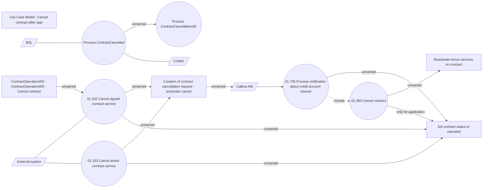

# Cancel contract on external request

- **Diagram Type**: Use Case
- **Package**: HomerSelect/BSL/Analysis Model/Contract Management/Contract cancellation/Use Case Model
- **Diagram ID**: 161505
- **Elements**: 15
- **Connectors**: 16

