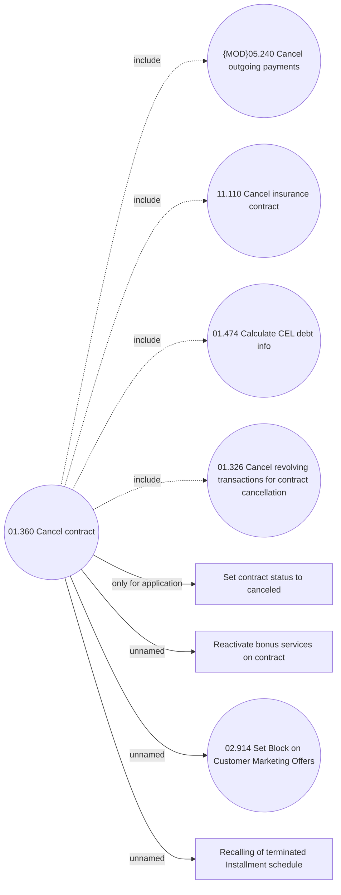

# Cancel contract

- **Diagram Type**: Use Case
- **Package**: HomerSelect/BSL/Analysis Model/Contract Management/Contract cancellation/Use Case Model
- **Diagram ID**: 161504
- **Elements**: 9
- **Connectors**: 8

