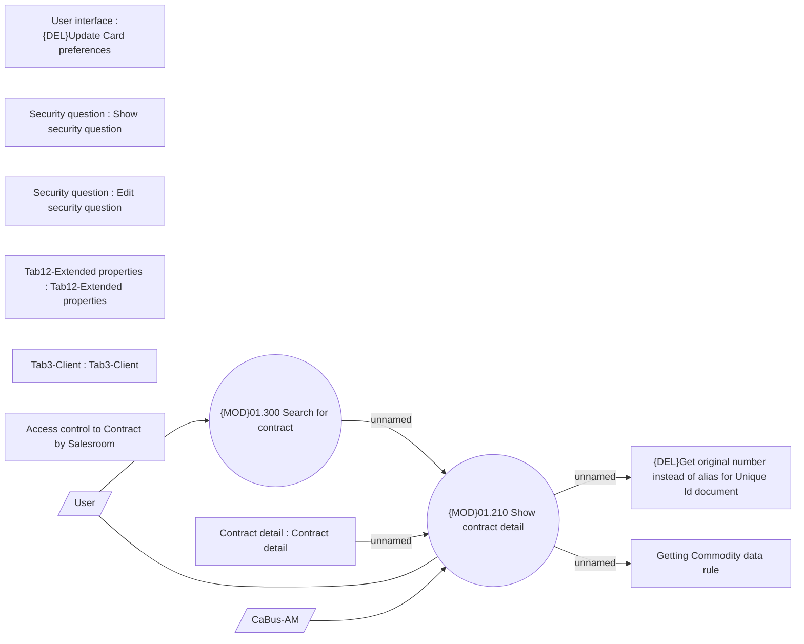

# Contract detail

- **Diagram Type**: Use Case
- **Package**: HomerSelect/BSL/Analysis Model/Contract Management/Contract detail/Show contract detail/UseCase Model
- **Diagram ID**: 163927
- **Elements**: 13
- **Connectors**: 7

