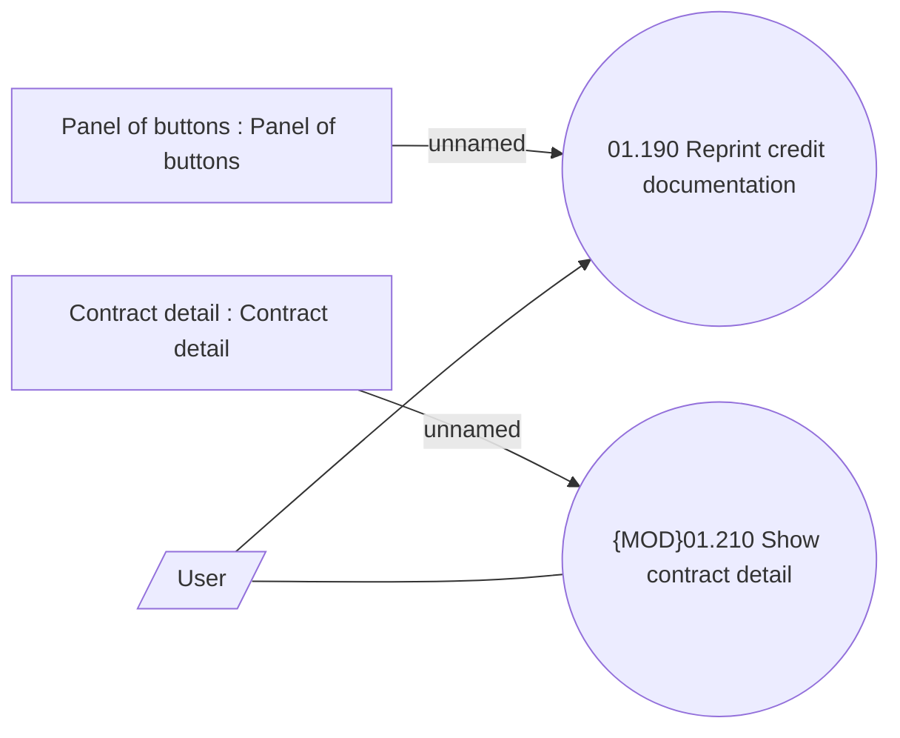

# Reprint credit documentation use cases

- **Diagram Type**: Use Case
- **Package**: HomerSelect/BSL/Analysis Model/Contract Management/Contract documentation reprint/UseCase Model
- **Diagram ID**: 157863
- **Elements**: 5
- **Connectors**: 4

