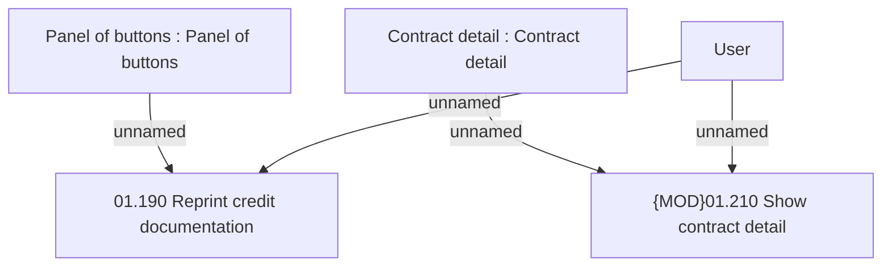

# Reprint credit documentation use cases

```mermaid
graph TD
    Panel_of_buttons_Panel_of_buttons["Panel of buttons : Panel of buttons"]
    n_01_190_Reprint_credit_documentation["01.190 Reprint credit documentation"]
    Contract_detail_Contract_detail["Contract detail : Contract detail"]
    MOD_01_210_Show_contract_detail["{MOD}01.210 Show contract detail"]
    User["User"]
    Contract_detail_Contract_detail -->|unnamed| MOD_01_210_Show_contract_detail
    Panel_of_buttons_Panel_of_buttons -->|unnamed| n_01_190_Reprint_credit_documentation
    User -->|unnamed| MOD_01_210_Show_contract_detail
    User -->|unnamed| n_01_190_Reprint_credit_documentation
```
