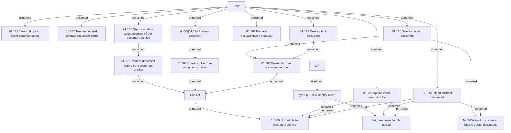

# Document copy management

```mermaid
graph TD
    n_01_129_Take_and_upload_client_document_photo["01.129 Take and upload client document photo"]
    n_01_127_Take_and_upload_contract_document_photo["01.127 Take and upload contract document photo"]
    CIF["CIF"]
    MOD_06_010_Identify_Client["{MOD}06.010 Identify Client"]
    Tab2_Contract_documents_Tab2_Contract_documents["Tab2-Contract documents : Tab2-Contract documents"]
    n_01_123_Delete_client_document["01.123 Delete client document"]
    n_01_126_Upload_client_document_file["01.126 Upload client document file"]
    n_01_120_Delete_contract_document["01.120 Delete contract document"]
    n_01_182_Prepare_documentation_manually["01.182 Prepare documentation manually"]
    Set_parameters_for_file_upload["Set parameters for file upload"]
    n_01_135_Get_information_about_document_from_document_archiv["01.135 Get information about document from document archive"]
    n_01_007_Retrieve_document_history_from_document_archive["01.007 Retrieve document history from document archive"]
    n_01_008_Download_file_from_document_archive["01.008 Download file from document archive"]
    MOD_01_128_Preview_document["{MOD}01.128 Preview document"]
    Cabinet["Cabinet"]
    n_01_009_Upload_file_to_document_archive["01.009 Upload file to document archive"]
    User["User"]
    n_01_125_Upload_contract_document["01.125 Upload contract document"]
    n_01_006_Delete_file_from_document_archive["01.006 Delete file from document archive"]
    n_01_135_Get_information_about_document_from_document_archiv -->|unnamed| n_01_007_Retrieve_document_history_from_document_archive
    n_01_125_Upload_contract_document -->|unnamed| Tab2_Contract_documents_Tab2_Contract_documents
    n_01_120_Delete_contract_document -->|unnamed| Tab2_Contract_documents_Tab2_Contract_documents
    n_01_126_Upload_client_document_file -->|unnamed| Set_parameters_for_file_upload
    n_01_125_Upload_contract_document -->|unnamed| Set_parameters_for_file_upload
    n_01_123_Delete_client_document -->|unnamed| n_01_006_Delete_file_from_document_archive
    MOD_01_128_Preview_document -->|unnamed| n_01_008_Download_file_from_document_archive
    n_01_006_Delete_file_from_document_archive -->|unnamed| Cabinet
    n_01_008_Download_file_from_document_archive -->|unnamed| Cabinet
    n_01_007_Retrieve_document_history_from_document_archive -->|unnamed| Cabinet
    n_01_125_Upload_contract_document -->|unnamed| n_01_009_Upload_file_to_document_archive
    MOD_06_010_Identify_Client -->|unnamed| n_01_009_Upload_file_to_document_archive
    n_01_126_Upload_client_document_file -->|unnamed| n_01_009_Upload_file_to_document_archive
    n_01_120_Delete_contract_document -->|unnamed| n_01_006_Delete_file_from_document_archive
    MOD_06_010_Identify_Client -->|unnamed| Set_parameters_for_file_upload
    Cabinet -->|unnamed| n_01_009_Upload_file_to_document_archive
    User -->|unnamed| n_01_123_Delete_client_document
    User -->|unnamed| n_01_182_Prepare_documentation_manually
    User -->|unnamed| MOD_01_128_Preview_document
    User -->|unnamed| n_01_135_Get_information_about_document_from_document_archiv
    User -->|unnamed| n_01_127_Take_and_upload_contract_document_photo
    User -->|unnamed| n_01_126_Upload_client_document_file
    User -->|unnamed| n_01_129_Take_and_upload_client_document_photo
    User -->|unnamed| n_01_125_Upload_contract_document
    User -->|unnamed| n_01_120_Delete_contract_document
    CIF -->|unnamed| MOD_06_010_Identify_Client
```
