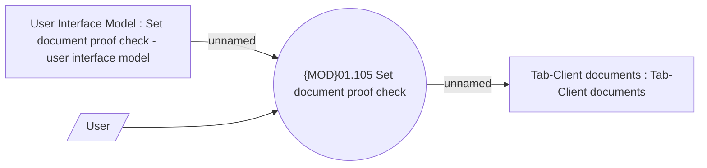

# Document proof check - use case model

- **Diagram Type**: Use Case
- **Package**: HomerSelect/BSL/Analysis Model/Contract Management/Contract documents management/UseCase Model
- **Diagram ID**: 164551
- **Elements**: 4
- **Connectors**: 3

