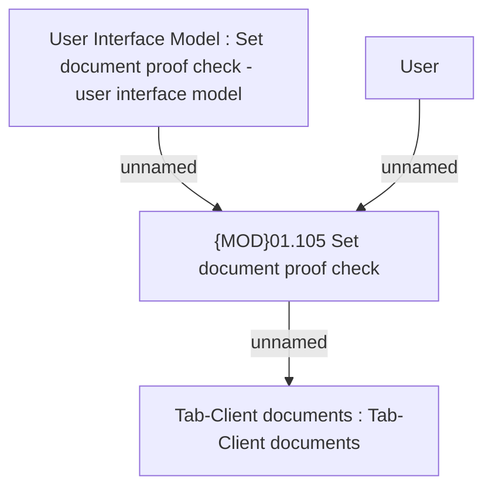

# Document proof check - use case model

```mermaid
graph TD
    User_Interface_Model_Set_document_proof_check_user_interface["User Interface Model : Set document proof check - user interface model"]
    Tab_Client_documents_Tab_Client_documents["Tab-Client documents : Tab-Client documents"]
    User["User"]
    MOD_01_105_Set_document_proof_check["{MOD}01.105 Set document proof check"]
    User_Interface_Model_Set_document_proof_check_user_interface -->|unnamed| MOD_01_105_Set_document_proof_check
    MOD_01_105_Set_document_proof_check -->|unnamed| Tab_Client_documents_Tab_Client_documents
    User -->|unnamed| MOD_01_105_Set_document_proof_check
```
