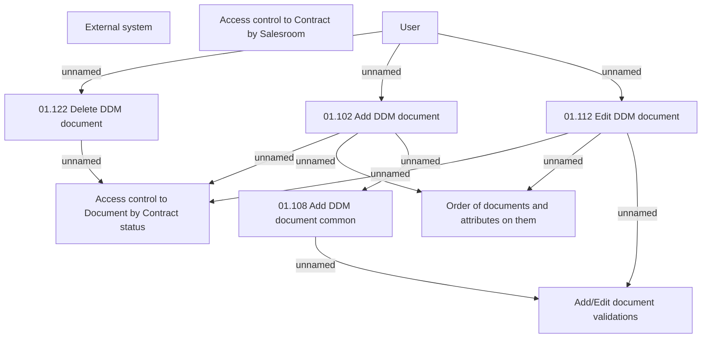

# Edit DDM documents

```mermaid
graph TD
    n_01_108_Add_DDM_document_common["01.108 Add DDM document common"]
    External_system["External system"]
    Add_Edit_document_validations["Add/Edit document validations"]
    Order_of_documents_and_attributes_on_them["Order of documents and attributes on them"]
    Access_control_to_Contract_by_Salesroom["Access control to Contract by Salesroom"]
    Access_control_to_Document_by_Contract_status["Access control to Document by Contract status"]
    User["User"]
    n_01_122_Delete_DDM_document["01.122 Delete DDM document"]
    n_01_112_Edit_DDM_document["01.112 Edit DDM document"]
    n_01_102_Add_DDM_document["01.102 Add DDM document"]
    n_01_102_Add_DDM_document -->|unnamed| Access_control_to_Document_by_Contract_status
    n_01_112_Edit_DDM_document -->|unnamed| Access_control_to_Document_by_Contract_status
    n_01_122_Delete_DDM_document -->|unnamed| Access_control_to_Document_by_Contract_status
    n_01_102_Add_DDM_document -->|unnamed| Order_of_documents_and_attributes_on_them
    n_01_112_Edit_DDM_document -->|unnamed| Order_of_documents_and_attributes_on_them
    n_01_112_Edit_DDM_document -->|unnamed| Add_Edit_document_validations
    n_01_108_Add_DDM_document_common -->|unnamed| Add_Edit_document_validations
    n_01_102_Add_DDM_document -->|unnamed| n_01_108_Add_DDM_document_common
    User -->|unnamed| n_01_122_Delete_DDM_document
    User -->|unnamed| n_01_102_Add_DDM_document
    User -->|unnamed| n_01_112_Edit_DDM_document
```
