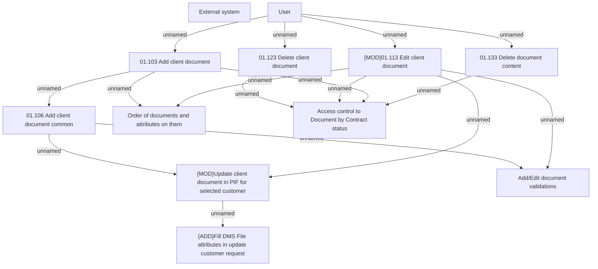

# Edit client documents

```mermaid
graph TD
    ADD_Fill_DMS_File_attributes_in_update_customer_request["{ADD}Fill DMS File attributes in update customer request"]
    MOD_Update_client_document_in_PIF_for_selected_customer["{MOD}Update client document in PIF for selected customer"]
    External_system["External system"]
    n_01_106_Add_client_document_common["01.106 Add client document common"]
    n_01_133_Delete_document_content["01.133 Delete document content"]
    Order_of_documents_and_attributes_on_them["Order of documents and attributes on them"]
    Add_Edit_document_validations["Add/Edit document validations"]
    Access_control_to_Document_by_Contract_status["Access control to Document by Contract status"]
    User["User"]
    MOD_01_113_Edit_client_document["{MOD}01.113 Edit client document"]
    n_01_103_Add_client_document["01.103 Add client document"]
    n_01_123_Delete_client_document["01.123 Delete client document"]
    n_01_106_Add_client_document_common -->|unnamed| Add_Edit_document_validations
    n_01_106_Add_client_document_common -->|unnamed| MOD_Update_client_document_in_PIF_for_selected_customer
    MOD_01_113_Edit_client_document -->|unnamed| MOD_Update_client_document_in_PIF_for_selected_customer
    n_01_103_Add_client_document -->|unnamed| n_01_106_Add_client_document_common
    n_01_103_Add_client_document -->|unnamed| Order_of_documents_and_attributes_on_them
    MOD_Update_client_document_in_PIF_for_selected_customer -->|unnamed| ADD_Fill_DMS_File_attributes_in_update_customer_request
    MOD_01_113_Edit_client_document -->|unnamed| Add_Edit_document_validations
    n_01_123_Delete_client_document -->|unnamed| Access_control_to_Document_by_Contract_status
    MOD_01_113_Edit_client_document -->|unnamed| Access_control_to_Document_by_Contract_status
    n_01_103_Add_client_document -->|unnamed| Access_control_to_Document_by_Contract_status
    n_01_133_Delete_document_content -->|unnamed| Access_control_to_Document_by_Contract_status
    MOD_01_113_Edit_client_document -->|unnamed| Order_of_documents_and_attributes_on_them
    User -->|unnamed| MOD_01_113_Edit_client_document
    User -->|unnamed| n_01_123_Delete_client_document
    User -->|unnamed| n_01_133_Delete_document_content
    User -->|unnamed| n_01_103_Add_client_document
```
