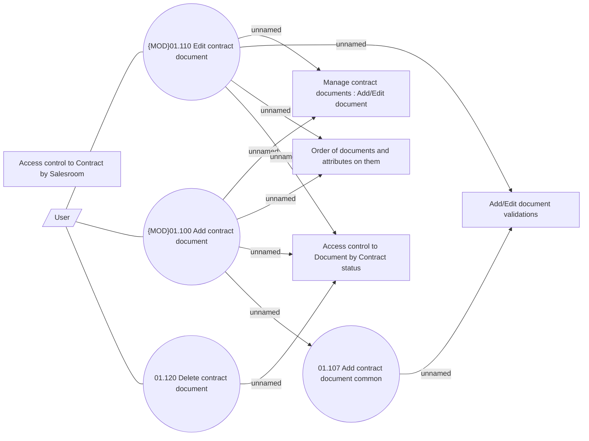

# Edit contract documents

- **Diagram Type**: Use Case
- **Package**: HomerSelect/BSL/Analysis Model/Contract Management/Contract documents management/UseCase Model
- **Diagram ID**: 164552
- **Elements**: 10
- **Connectors**: 13

