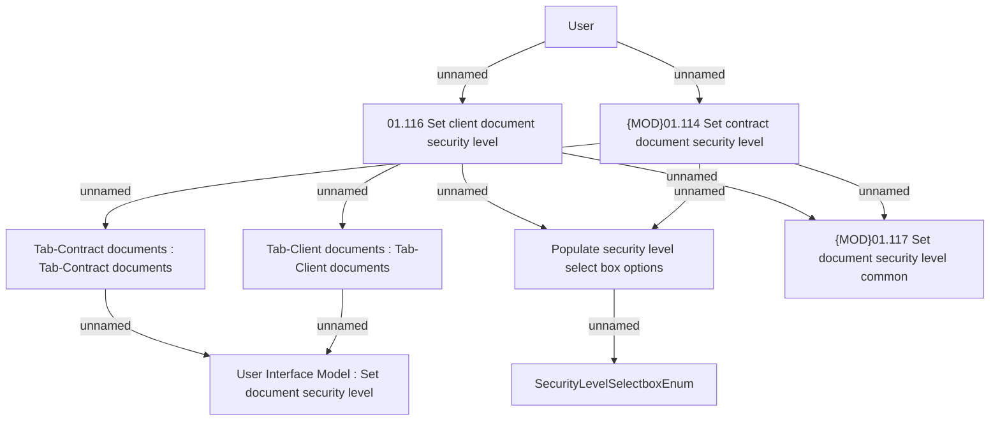

# Set document security level

```mermaid
graph TD
    Populate_security_level_select_box_options["Populate security level select box options"]
    SecurityLevelSelectboxEnum["SecurityLevelSelectboxEnum"]
    User_Interface_Model_Set_document_security_level["User Interface Model : Set document security level"]
    Tab_Client_documents_Tab_Client_documents["Tab-Client documents : Tab-Client documents"]
    Tab_Contract_documents_Tab_Contract_documents["Tab-Contract documents : Tab-Contract documents"]
    MOD_01_114_Set_contract_document_security_level["{MOD}01.114 Set contract document security level"]
    n_01_116_Set_client_document_security_level["01.116 Set client document security level"]
    MOD_01_117_Set_document_security_level_common["{MOD}01.117 Set document security level common"]
    User["User"]
    n_01_116_Set_client_document_security_level -->|unnamed| MOD_01_117_Set_document_security_level_common
    MOD_01_114_Set_contract_document_security_level -->|unnamed| MOD_01_117_Set_document_security_level_common
    MOD_01_114_Set_contract_document_security_level -->|unnamed| Tab_Contract_documents_Tab_Contract_documents
    n_01_116_Set_client_document_security_level -->|unnamed| Tab_Client_documents_Tab_Client_documents
    Tab_Contract_documents_Tab_Contract_documents -->|unnamed| User_Interface_Model_Set_document_security_level
    Tab_Client_documents_Tab_Client_documents -->|unnamed| User_Interface_Model_Set_document_security_level
    Populate_security_level_select_box_options -->|unnamed| SecurityLevelSelectboxEnum
    n_01_116_Set_client_document_security_level -->|unnamed| Populate_security_level_select_box_options
    MOD_01_114_Set_contract_document_security_level -->|unnamed| Populate_security_level_select_box_options
    User -->|unnamed| MOD_01_114_Set_contract_document_security_level
    User -->|unnamed| n_01_116_Set_client_document_security_level
```
