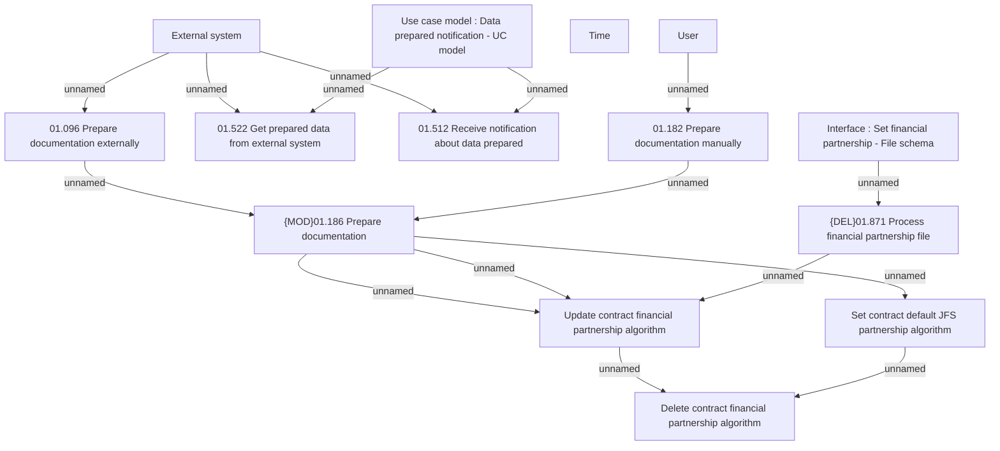

# Financial partnership

```mermaid
graph TD
    Delete_contract_financial_partnership_algorithm["Delete contract financial partnership algorithm"]
    MOD_01_186_Prepare_documentation["{MOD}01.186 Prepare documentation"]
    Interface_Set_financial_partnership_File_schema["Interface : Set financial partnership - File schema"]
    Set_contract_default_JFS_partnership_algorithm["Set contract default JFS partnership algorithm"]
    Update_contract_financial_partnership_algorithm["Update contract financial partnership algorithm"]
    Use_case_model_Data_prepared_notification_UC_model["Use case model : Data prepared notification - UC model"]
    n_01_522_Get_prepared_data_from_external_system["01.522 Get prepared data from external system"]
    n_01_512_Receive_notification_about_data_prepared["01.512 Receive notification about data prepared"]
    External_system["External system"]
    n_01_096_Prepare_documentation_externally["01.096 Prepare documentation externally"]
    n_01_182_Prepare_documentation_manually["01.182 Prepare documentation manually"]
    Time["Time"]
    DEL_01_871_Process_financial_partnership_file["{DEL}01.871 Process financial partnership file"]
    User["User"]
    Set_contract_default_JFS_partnership_algorithm -->|unnamed| Delete_contract_financial_partnership_algorithm
    Interface_Set_financial_partnership_File_schema -->|unnamed| DEL_01_871_Process_financial_partnership_file
    Use_case_model_Data_prepared_notification_UC_model -->|unnamed| n_01_522_Get_prepared_data_from_external_system
    Use_case_model_Data_prepared_notification_UC_model -->|unnamed| n_01_512_Receive_notification_about_data_prepared
    Update_contract_financial_partnership_algorithm -->|unnamed| Delete_contract_financial_partnership_algorithm
    DEL_01_871_Process_financial_partnership_file -->|unnamed| Update_contract_financial_partnership_algorithm
    MOD_01_186_Prepare_documentation -->|unnamed| Set_contract_default_JFS_partnership_algorithm
    n_01_182_Prepare_documentation_manually -->|unnamed| MOD_01_186_Prepare_documentation
    MOD_01_186_Prepare_documentation -->|unnamed| Update_contract_financial_partnership_algorithm
    MOD_01_186_Prepare_documentation -->|unnamed| Update_contract_financial_partnership_algorithm
    n_01_096_Prepare_documentation_externally -->|unnamed| MOD_01_186_Prepare_documentation
    External_system -->|unnamed| n_01_512_Receive_notification_about_data_prepared
    External_system -->|unnamed| n_01_096_Prepare_documentation_externally
    External_system -->|unnamed| n_01_522_Get_prepared_data_from_external_system
    User -->|unnamed| n_01_182_Prepare_documentation_manually
```
