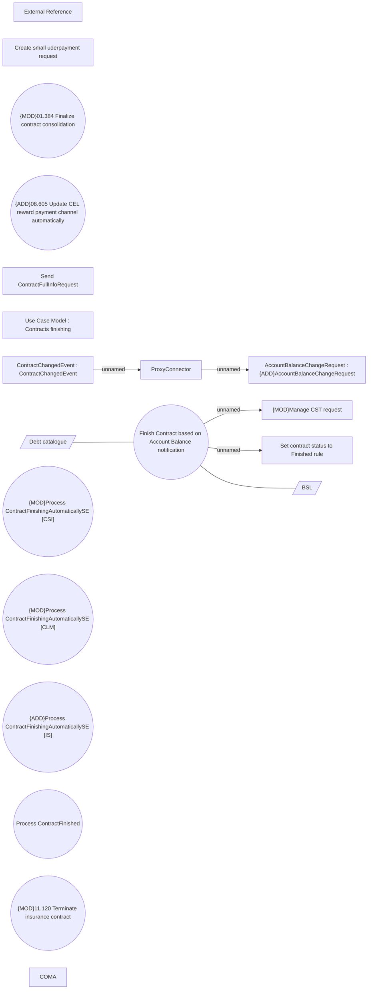

# Contract finishing automatically

- **Diagram Type**: Use Case
- **Package**: HomerSelect/BSL/Analysis Model/Contract Management/Contract finishing/UseCase Model
- **Diagram ID**: 161765
- **Elements**: 21
- **Connectors**: 6

