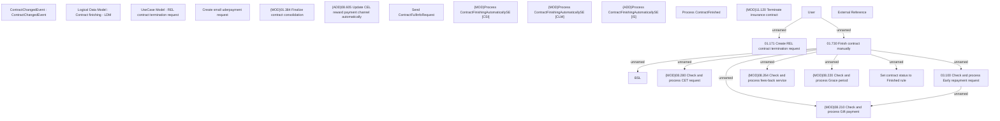

# Contract finishing manually

```mermaid
graph TD
    ContractChangedEvent_ContractChangedEvent["ContractChangedEvent : ContractChangedEvent"]
    BSL["BSL"]
    Logical_Data_Model_Contract_finishing_LDM["Logical Data Model : Contract finishing - LDM"]
    UseCase_Model_REL_contract_termination_request["UseCase Model : REL contract termination request"]
    Create_small_uderpayment_request["Create small uderpayment request"]
    MOD_01_384_Finalize_contract_consolidation["{MOD}01.384 Finalize contract consolidation"]
    ADD_08_605_Update_CEL_reward_payment_channel_automatically["{ADD}08.605 Update CEL reward payment channel automatically"]
    Send_ContractFullInfoRequest["Send ContractFullInfoRequest"]
    MOD_Process_ContractFinishingAutomaticallySE_CSI["{MOD}Process ContractFinishingAutomaticallySE [CSI]"]
    MOD_Process_ContractFinishingAutomaticallySE_CLM["{MOD}Process ContractFinishingAutomaticallySE [CLM]"]
    ADD_Process_ContractFinishingAutomaticallySE_IS["{ADD}Process ContractFinishingAutomaticallySE [IS]"]
    Process_ContractFinished["Process ContractFinished"]
    MOD_08_210_Check_and_process_Gift_payment["{MOD}08.210 Check and process Gift payment"]
    MOD_08_280_Check_and_process_CET_request["{MOD}08.280 Check and process CET request"]
    n_03_100_Check_and_process_Early_repayment_request["03.100 Check and process Early repayment request"]
    MOD_08_264_Check_and_process_fees_back_service["{MOD}08.264 Check and process fees-back service"]
    MOD_08_220_Check_and_process_Grace_period["{MOD}08.220 Check and process Grace period"]
    n_01_171_Create_REL_contract_termination_request["01.171 Create REL contract termination request"]
    Set_contract_status_to_Finished_rule["Set contract status to Finished rule"]
    MOD_11_120_Terminate_insurance_contract["{MOD}11.120 Terminate insurance contract"]
    User["User"]
    n_01_730_Finish_contract_manually["01.730 Finish contract manually"]
    External_Reference["External Reference"]
    n_01_730_Finish_contract_manually -->|unnamed| MOD_08_280_Check_and_process_CET_request
    n_01_730_Finish_contract_manually -->|unnamed| BSL
    n_01_730_Finish_contract_manually -->|unnamed| MOD_08_210_Check_and_process_Gift_payment
    n_01_730_Finish_contract_manually -->|unnamed| n_03_100_Check_and_process_Early_repayment_request
    n_01_730_Finish_contract_manually -->|unnamed| MOD_08_264_Check_and_process_fees_back_service
    n_01_730_Finish_contract_manually -->|unnamed| MOD_08_220_Check_and_process_Grace_period
    n_01_730_Finish_contract_manually -->|unnamed| Set_contract_status_to_Finished_rule
    User -->|unnamed| n_01_171_Create_REL_contract_termination_request
    User -->|unnamed| n_01_730_Finish_contract_manually
    n_03_100_Check_and_process_Early_repayment_request -->|unnamed| MOD_08_210_Check_and_process_Gift_payment
```
