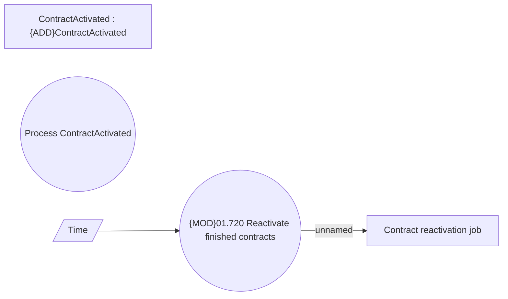

# Contract reactivation

- **Diagram Type**: Use Case
- **Package**: HomerSelect/BSL/Analysis Model/Contract Management/Contract finishing/UseCase Model
- **Diagram ID**: 161768
- **Elements**: 5
- **Connectors**: 2

