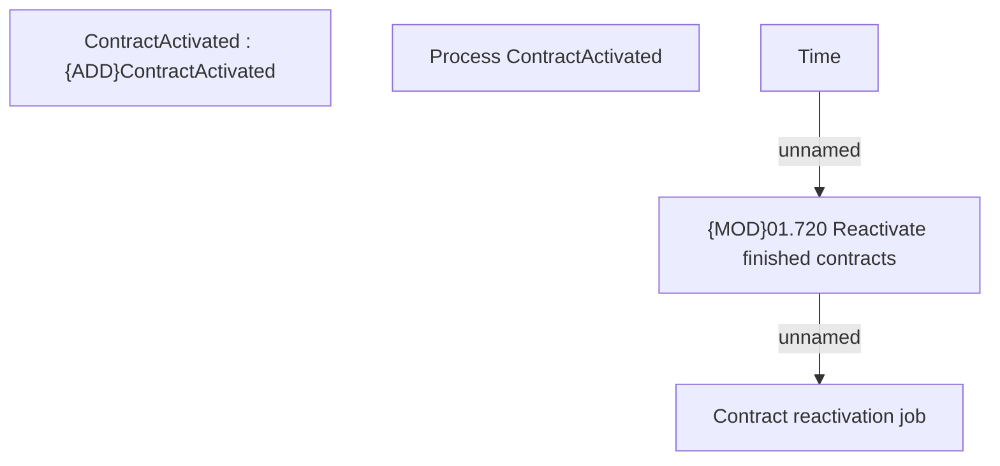

# Contract reactivation

```mermaid
graph TD
    ContractActivated_ADD_ContractActivated["ContractActivated : {ADD}ContractActivated"]
    Process_ContractActivated["Process ContractActivated"]
    Contract_reactivation_job["Contract reactivation job"]
    MOD_01_720_Reactivate_finished_contracts["{MOD}01.720 Reactivate finished contracts"]
    Time["Time"]
    MOD_01_720_Reactivate_finished_contracts -->|unnamed| Contract_reactivation_job
    Time -->|unnamed| MOD_01_720_Reactivate_finished_contracts
```
