# REL contract termination request

- **Diagram Type**: Use Case
- **Package**: HomerSelect/BSL/Analysis Model/Contract Management/Contract finishing/UseCase Model
- **Diagram ID**: 161767
- **Elements**: 27
- **Connectors**: 18

```mermaid
graph LR
    n_05_550_Create_refund_of_overpayment_on_request(("05.550 Create refund of overpayment on request"))
    External_Reference["External Reference"]
    MOD_01_384_Finalize_contract_consolidation(("{MOD}01.384 Finalize contract consolidation"))
    ADD_08_605_Update_CEL_reward_payment_channel_automatically(("{ADD}08.605 Update CEL reward payment channel automatically"))
    Send_ContractFullInfoRequest["Send ContractFullInfoRequest"]
    MOD_Process_ContractFinishingAutomaticallySE_CSI(("{MOD}Process ContractFinishingAutomaticallySE [CSI]"))
    MOD_Process_ContractFinishingAutomaticallySE_CLM(("{MOD}Process ContractFinishingAutomaticallySE [CLM]"))
    ADD_Process_ContractFinishingAutomaticallySE_IS(("{ADD}Process ContractFinishingAutomaticallySE [IS]"))
    Process_ContractFinished(("Process ContractFinished"))
    MOD_11_120_Terminate_insurance_contract(("{MOD}11.120 Terminate insurance contract"))
    ContractChangedEvent_ContractChangedEvent["ContractChangedEvent : ContractChangedEvent"]
    BSL[/"BSL"/]
    Set_contract_status_to_Finished_rule["Set contract status to Finished rule"]
    Account_Management_Account_ManagementWS_Account_termination["Account Management : Account ManagementWS - Account termination"]
    Account_Management_AccountManagementWS_Terminate_account["Account Management : AccountManagementWS - Terminate account"]
    Account_Management_AccountManagementWS_Terminate_account["Account Management : AccountManagementWS - Terminate account"]
    n_01_740_Process_notification_about_credit_account_closure(("01.740 Process notification about credit account closure "))
    Loyalty_program[/"Loyalty program"/]
    CaBus_AM[/"CaBus-AM"/]
    Panel_of_buttons_Panel_of_buttons["Panel of buttons : Panel of buttons"]
    Contract_Status_Transition_Request_Check["Contract Status Transition Request Check"]
    Calculation_of_future_debt_for_REL_contract["Calculation of future debt for REL contract"]
    Logical_Data_Model_Contract_finishing_LDM["Logical Data Model : Contract finishing - LDM"]
    User_Interface_Model_Create_REL_contract_termination_request["User Interface Model : Create REL contract termination request - UI"]
    User[/"User"/]
    n_01_172_Cancel_REL_contract_termination_request_manually(("01.172 Cancel REL contract termination request manually"))
    n_01_171_Create_REL_contract_termination_request(("01.171 Create REL contract termination request"))
    n_01_171_Create_REL_contract_termination_request -->|unnamed| Contract_Status_Transition_Request_Check
    n_01_740_Process_notification_about_credit_account_closure -->|unnamed| Set_contract_status_to_Finished_rule
    n_01_171_Create_REL_contract_termination_request -->|unnamed| Panel_of_buttons_Panel_of_buttons
    n_01_171_Create_REL_contract_termination_request -->|unnamed| Calculation_of_future_debt_for_REL_contract
    n_01_171_Create_REL_contract_termination_request -->|unnamed| User_Interface_Model_Create_REL_contract_termination_request
    Account_Management_AccountManagementWS_Terminate_account -->|unnamed| n_01_172_Cancel_REL_contract_termination_request_manually
    Account_Management_AccountManagementWS_Terminate_account -->|unnamed| n_01_171_Create_REL_contract_termination_request
    Account_Management_Account_ManagementWS_Account_termination -->|unnamed| n_01_171_Create_REL_contract_termination_request
    n_01_172_Cancel_REL_contract_termination_request_manually -->|unnamed| Panel_of_buttons_Panel_of_buttons
    n_01_740_Process_notification_about_credit_account_closure --- BSL
    Loyalty_program --> n_01_172_Cancel_REL_contract_termination_request_manually
    Loyalty_program --> n_01_171_Create_REL_contract_termination_request
    Loyalty_program --> n_01_740_Process_notification_about_credit_account_closure
    User --> n_01_172_Cancel_REL_contract_termination_request_manually
    User --> n_01_171_Create_REL_contract_termination_request
    CaBus_AM --> n_01_740_Process_notification_about_credit_account_closure
    CaBus_AM --> n_01_172_Cancel_REL_contract_termination_request_manually
    CaBus_AM --> n_01_171_Create_REL_contract_termination_request
```

