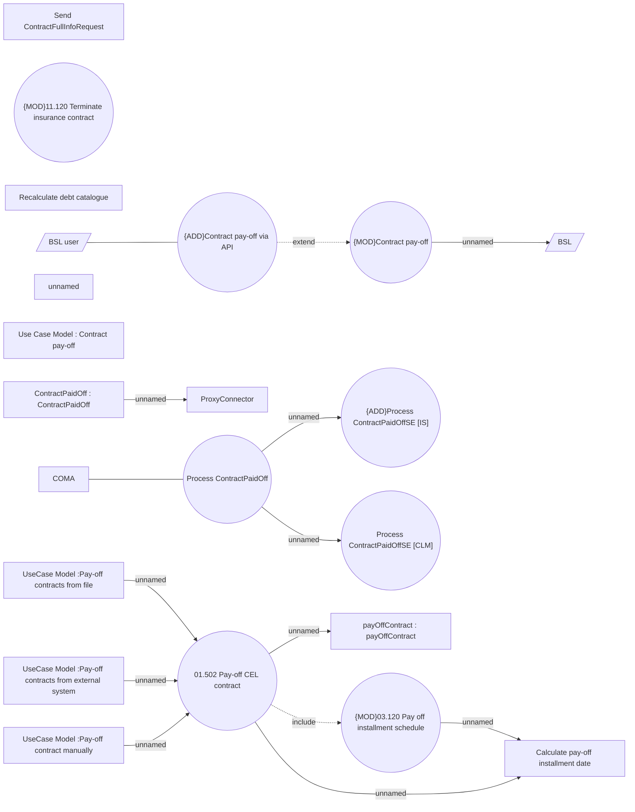

# Pay-off CEL contract

- **Diagram Type**: Use Case
- **Package**: HomerSelect/BSL/Analysis Model/Contract Management/Contract pay-off/UseCase Model
- **Diagram ID**: 164396
- **Elements**: 24
- **Connectors**: 14

