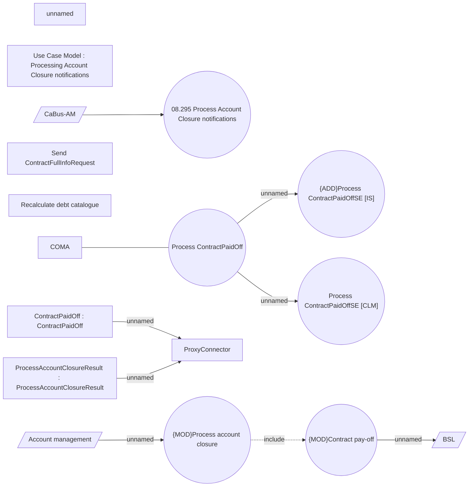

# Pay-off REL contract

- **Diagram Type**: Use Case
- **Package**: HomerSelect/BSL/Analysis Model/Contract Management/Contract pay-off/UseCase Model
- **Diagram ID**: 164397
- **Elements**: 21
- **Connectors**: 9

