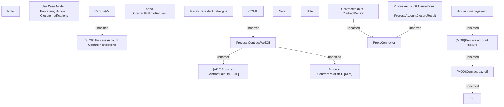

# Pay-off REL contract

```mermaid
graph TD
    el_1878649["Note"]
    Use_Case_Model_Processing_Account_Closure_notifications["Use Case Model : Processing Account Closure notifications"]
    n_08_295_Process_Account_Closure_notifications["08.295 Process Account Closure notifications"]
    CaBus_AM["CaBus-AM"]
    Send_ContractFullInfoRequest["Send ContractFullInfoRequest"]
    Recalculate_debt_catalogue["Recalculate debt catalogue"]
    ADD_Process_ContractPaidOffSE_IS["{ADD}Process ContractPaidOffSE [IS]"]
    COMA["COMA"]
    el_1878659["Note"]
    Process_ContractPaidOff["Process ContractPaidOff"]
    Process_ContractPaidOffSE_CLM["Process ContractPaidOffSE [CLM] "]
    el_1878645["Note"]
    ProxyConnector["ProxyConnector"]
    MOD_Process_account_closure["{MOD}Process account closure"]
    ProcessAccountClosureResult_ProcessAccountClosureResult["ProcessAccountClosureResult : ProcessAccountClosureResult"]
    ProxyConnector["ProxyConnector"]
    ContractPaidOff_ContractPaidOff["ContractPaidOff : ContractPaidOff"]
    MOD_Contract_pay_off["{MOD}Contract pay-off"]
    BSL["BSL"]
    Account_management["Account management"]
    COMA["COMA"]
    Account_management -->|unnamed| MOD_Process_account_closure
    MOD_Contract_pay_off -->|unnamed| BSL
    ContractPaidOff_ContractPaidOff -->|unnamed| ProxyConnector
    ProcessAccountClosureResult_ProcessAccountClosureResult -->|unnamed| ProxyConnector
    MOD_Process_account_closure -->|unnamed| MOD_Contract_pay_off
    Process_ContractPaidOff -->|unnamed| ADD_Process_ContractPaidOffSE_IS
    Process_ContractPaidOff -->|unnamed| Process_ContractPaidOffSE_CLM
    COMA -->|unnamed| Process_ContractPaidOff
    CaBus_AM -->|unnamed| n_08_295_Process_Account_Closure_notifications
```
