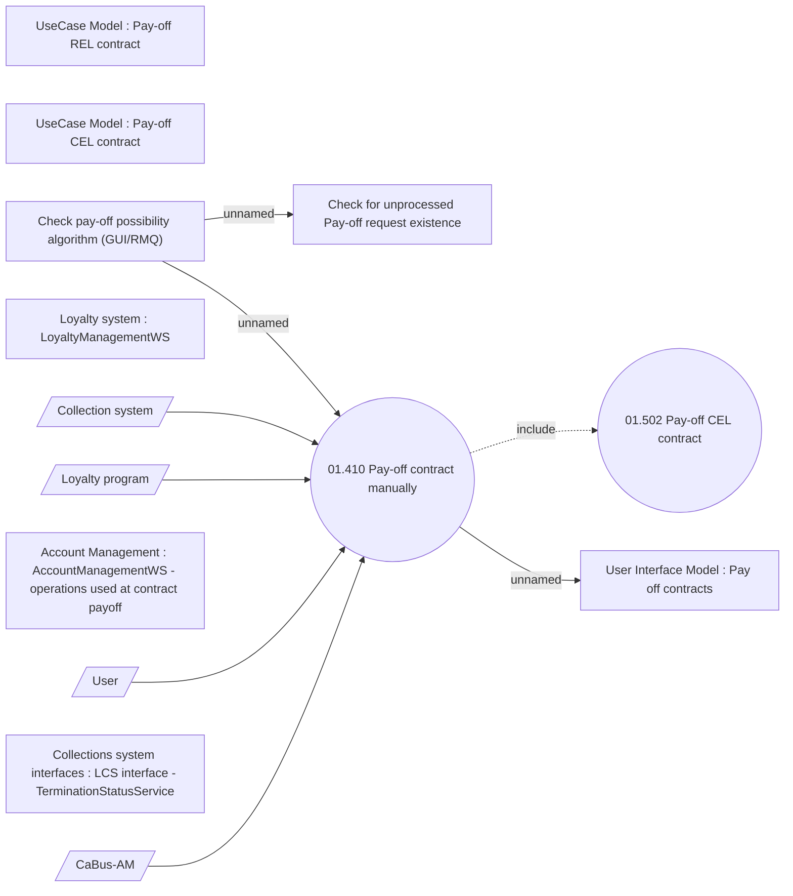

# Pay-off contract manually

- **Diagram Type**: Use Case
- **Package**: HomerSelect/BSL/Analysis Model/Contract Management/Contract pay-off/UseCase Model
- **Diagram ID**: 164393
- **Elements**: 14
- **Connectors**: 8

