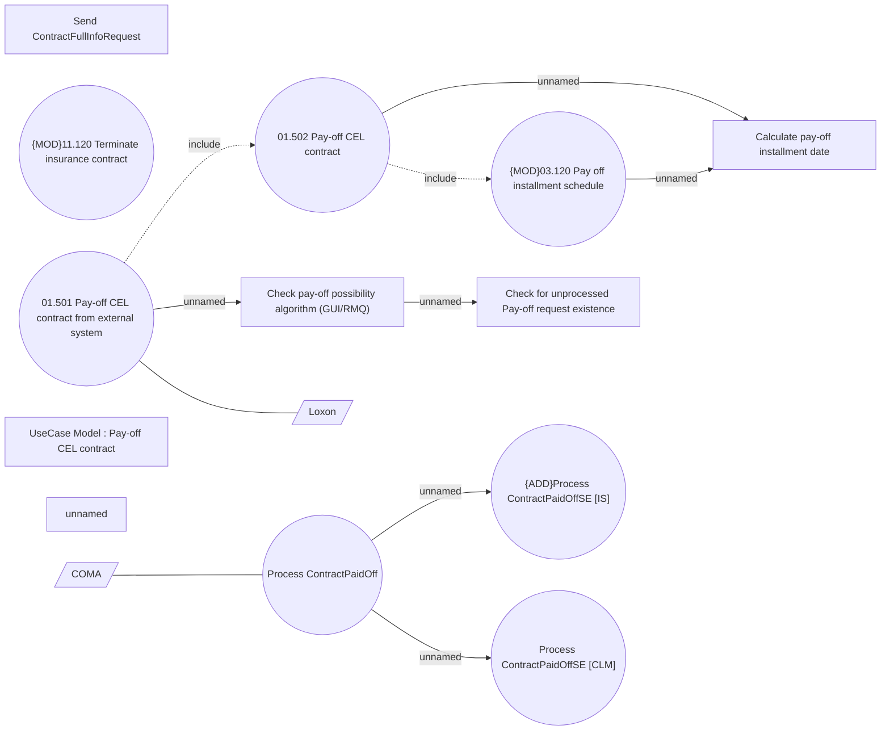

# Pay-off contracts from external system

- **Diagram Type**: Use Case
- **Package**: HomerSelect/BSL/Analysis Model/Contract Management/Contract pay-off/UseCase Model
- **Diagram ID**: 164394
- **Elements**: 15
- **Connectors**: 10

