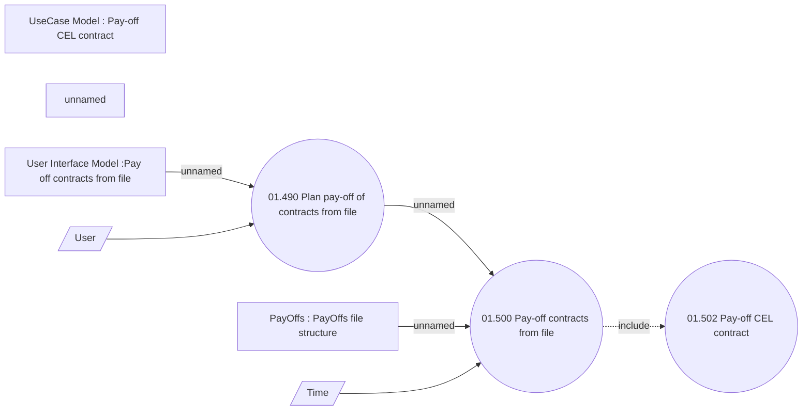

# Pay-off contracts from file

- **Diagram Type**: Use Case
- **Package**: HomerSelect/BSL/Analysis Model/Contract Management/Contract pay-off/UseCase Model
- **Diagram ID**: 164395
- **Elements**: 9
- **Connectors**: 6

