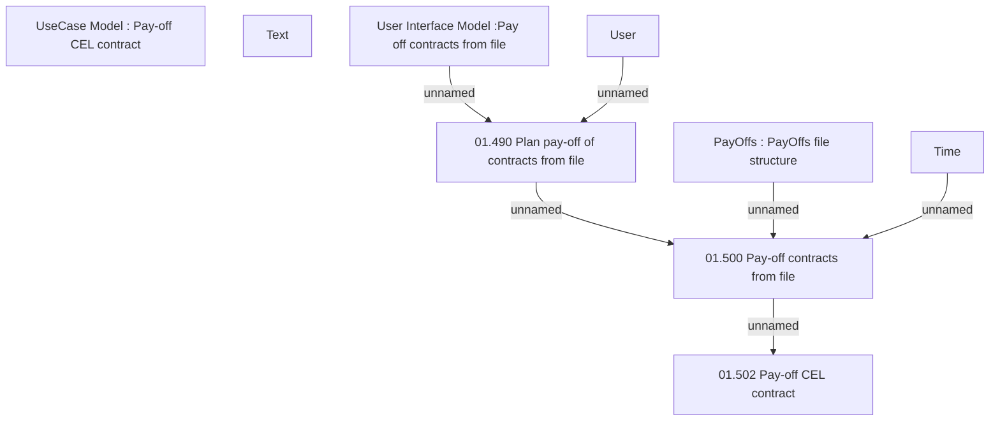

# Pay-off contracts from file

```mermaid
graph TD
    UseCase_Model_Pay_off_CEL_contract["UseCase Model : Pay-off CEL contract"]
    n_01_502_Pay_off_CEL_contract["01.502 Pay-off CEL contract"]
    el_1878653["Text"]
    User_Interface_Model_Pay_off_contracts_from_file["User Interface Model :Pay off contracts from file"]
    PayOffs_PayOffs_file_structure["PayOffs : PayOffs file structure"]
    User["User"]
    Time["Time"]
    n_01_490_Plan_pay_off_of_contracts_from_file["01.490 Plan pay-off of contracts from file"]
    n_01_500_Pay_off_contracts_from_file["01.500 Pay-off contracts from file"]
    n_01_500_Pay_off_contracts_from_file -->|unnamed| n_01_502_Pay_off_CEL_contract
    n_01_490_Plan_pay_off_of_contracts_from_file -->|unnamed| n_01_500_Pay_off_contracts_from_file
    PayOffs_PayOffs_file_structure -->|unnamed| n_01_500_Pay_off_contracts_from_file
    User_Interface_Model_Pay_off_contracts_from_file -->|unnamed| n_01_490_Plan_pay_off_of_contracts_from_file
    User -->|unnamed| n_01_490_Plan_pay_off_of_contracts_from_file
    Time -->|unnamed| n_01_500_Pay_off_contracts_from_file
```
