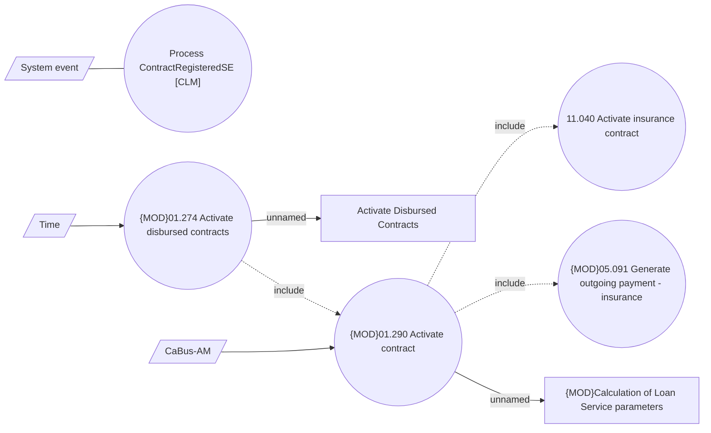

# Activation of contract on a repayment

- **Diagram Type**: Use Case
- **Package**: HomerSelect/BSL/Analysis Model/Contract Management/Contract registration/UseCase Model
- **Diagram ID**: 163264
- **Elements**: 10
- **Connectors**: 8

