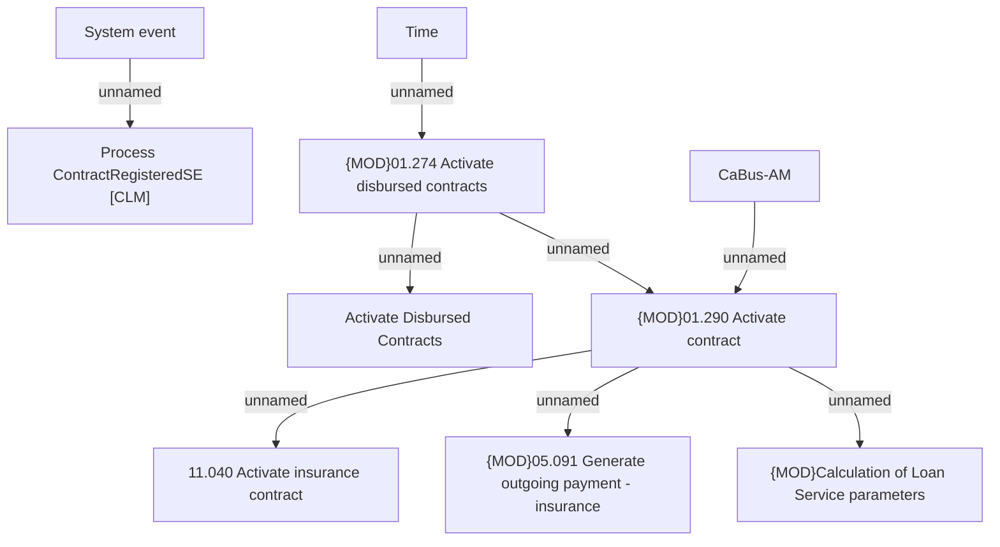

# Activation of contract on a repayment

```mermaid
graph TD
    Process_ContractRegisteredSE_CLM["Process ContractRegisteredSE [CLM]"]
    System_event["System event"]
    CaBus_AM["CaBus-AM"]
    MOD_Calculation_of_Loan_Service_parameters["{MOD}Calculation of Loan Service parameters"]
    MOD_05_091_Generate_outgoing_payment_insurance["{MOD}05.091 Generate outgoing payment - insurance"]
    Activate_Disbursed_Contracts["Activate Disbursed Contracts"]
    n_11_040_Activate_insurance_contract["11.040 Activate insurance contract"]
    Time["Time"]
    MOD_01_274_Activate_disbursed_contracts["{MOD}01.274 Activate disbursed contracts"]
    MOD_01_290_Activate_contract["{MOD}01.290 Activate contract"]
    MOD_01_274_Activate_disbursed_contracts -->|unnamed| MOD_01_290_Activate_contract
    MOD_01_290_Activate_contract -->|unnamed| n_11_040_Activate_insurance_contract
    MOD_01_274_Activate_disbursed_contracts -->|unnamed| Activate_Disbursed_Contracts
    MOD_01_290_Activate_contract -->|unnamed| MOD_05_091_Generate_outgoing_payment_insurance
    MOD_01_290_Activate_contract -->|unnamed| MOD_Calculation_of_Loan_Service_parameters
    Time -->|unnamed| MOD_01_274_Activate_disbursed_contracts
    System_event -->|unnamed| Process_ContractRegisteredSE_CLM
    CaBus_AM -->|unnamed| MOD_01_290_Activate_contract
```
