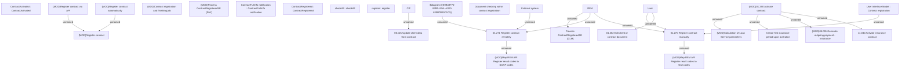

# Contract registration

```mermaid
graph TD
    ContractActivated_ContractActivated["ContractActivated : ContractActivated"]
    MOD_Register_contract_automatically["{MOD}Register contract automatically"]
    MOD_Register_contract_via_API["{MOD}Register contract via  API"]
    MOD_Register_contract["{MOD}Register contract"]
    ADD_Contract_registration_and_finishing_job["{ADD}Contract registration and finishing job"]
    MOD_Process_ContractRegisteredSE_PAY["{MOD}Process ContractRegisteredSE [PAY]"]
    ContractFullInfo_notification_ContractFullInfo_notification["ContractFullInfo notification : ContractFullInfo notification"]
    ContractRegistered_ContractRegistered["ContractRegistered : ContractRegistered"]
    checkAll_checkAll["checkAll : checkAll"]
    register_register["register : register"]
    MOD_Map_REM_API_Register_result_codes_to_GUI_codes["{MOD}Map REM API Register result codes to GUI codes"]
    MOD_Map_REM_API_Register_result_codes_to_SOAP_codes["{MOD}Map REM API Register result codes to SOAP codes"]
    REM["REM"]
    Process_ContractRegisteredSE_CLM["Process ContractRegisteredSE [CLM]"]
    n_01_282_Edit_client_or_contract_document["01.282 Edit client or contract document"]
    n_06_021_Update_client_data_from_contract["06.021 Update client data from contract"]
    User_Interface_Model_Contract_registration["User Interface Model : Contract registration"]
    Document_checking_within_contract_registration["Document checking within contract registration"]
    CIF["CIF"]
    diagram_E9B49F70_87BF_42a1_A1D0_639B7B15D1C5["$diagram://{E9B49F70-87BF-42a1-A1D0-639B7B15D1C5}"]
    External_system["External system"]
    n_01_271_Register_contract_remotely["01.271 Register contract remotely"]
    MOD_Calculation_of_Loan_Service_parameters["{MOD}Calculation of Loan Service parameters"]
    Create_first_insurance_period_upon_activation["Create first insurance period upon activation"]
    MOD_05_091_Generate_outgoing_payment_insurance["{MOD}05.091 Generate outgoing payment - insurance"]
    n_11_040_Activate_insurance_contract["11.040 Activate insurance contract"]
    MOD_01_290_Activate_contract["{MOD}01.290 Activate contract"]
    n_01_270_Register_contract_manually["01.270 Register contract manually"]
    User["User"]
    REM["REM"]
    diagram_E9B49F70_87BF_42a1_A1D0_639B7B15D1C5 -->|unnamed| n_01_271_Register_contract_remotely
    n_01_270_Register_contract_manually -->|unnamed| MOD_Map_REM_API_Register_result_codes_to_GUI_codes
    n_01_271_Register_contract_remotely -->|unnamed| MOD_Map_REM_API_Register_result_codes_to_SOAP_codes
    User_Interface_Model_Contract_registration -->|unnamed| n_01_270_Register_contract_manually
    MOD_01_290_Activate_contract -->|unnamed| MOD_Calculation_of_Loan_Service_parameters
    MOD_01_290_Activate_contract -->|unnamed| Create_first_insurance_period_upon_activation
    MOD_01_290_Activate_contract -->|unnamed| MOD_05_091_Generate_outgoing_payment_insurance
    MOD_01_290_Activate_contract -->|unnamed| n_11_040_Activate_insurance_contract
    External_system -->|unnamed| n_01_271_Register_contract_remotely
    REM -->|unnamed| Process_ContractRegisteredSE_CLM
    REM -->|unnamed| n_01_271_Register_contract_remotely
    REM -->|unnamed| n_01_270_Register_contract_manually
    User -->|unnamed| n_01_270_Register_contract_manually
    User -->|unnamed| n_01_282_Edit_client_or_contract_document
    CIF -->|unnamed| n_06_021_Update_client_data_from_contract
    MOD_Register_contract_via_API -->|unnamed| MOD_Register_contract
    MOD_Register_contract_automatically -->|unnamed| MOD_Register_contract
```
