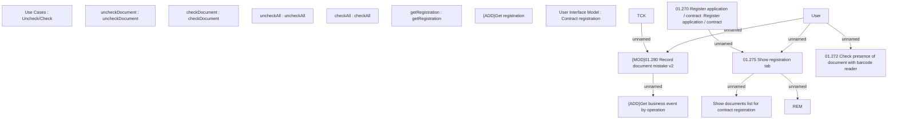

# Document checking within contract registration

```mermaid
graph TD
    Use_Cases_Uncheck_Check["Use Cases : Uncheck/Check"]
    uncheckDocument_uncheckDocument["uncheckDocument : uncheckDocument"]
    checkDocument_checkDocument["checkDocument : checkDocument"]
    uncheckAll_uncheckAll["uncheckAll : uncheckAll"]
    checkAll_checkAll["checkAll : checkAll"]
    getRegistration_getRegistration["getRegistration : getRegistration"]
    ADD_Get_registration["{ADD}Get registration"]
    REM["REM"]
    Show_documents_list_for_contract_registration["Show documents list for contract registration"]
    ADD_Get_business_event_by_operation["{ADD}Get business event by operation"]
    User_Interface_Model_Contract_registration["User Interface Model : Contract registration"]
    TCK["TCK"]
    MOD_01_280_Record_document_mistake_v2["{MOD}01.280 Record document mistake v2"]
    n_01_275_Show_registration_tab["01.275 Show registration tab"]
    n_01_272_Check_presence_of_document_with_barcode_reader["01.272 Check presence of document with barcode reader"]
    n_01_270_Register_application_contract_Register_application_["01.270 Register application / contract :Register application / contract"]
    User["User"]
    REM["REM"]
    n_01_270_Register_application_contract_Register_application_ -->|unnamed| n_01_275_Show_registration_tab
    MOD_01_280_Record_document_mistake_v2 -->|unnamed| ADD_Get_business_event_by_operation
    n_01_275_Show_registration_tab -->|unnamed| Show_documents_list_for_contract_registration
    n_01_275_Show_registration_tab -->|unnamed| REM
    TCK -->|unnamed| MOD_01_280_Record_document_mistake_v2
    User -->|unnamed| MOD_01_280_Record_document_mistake_v2
    User -->|unnamed| n_01_275_Show_registration_tab
    User -->|unnamed| n_01_272_Check_presence_of_document_with_barcode_reader
```
