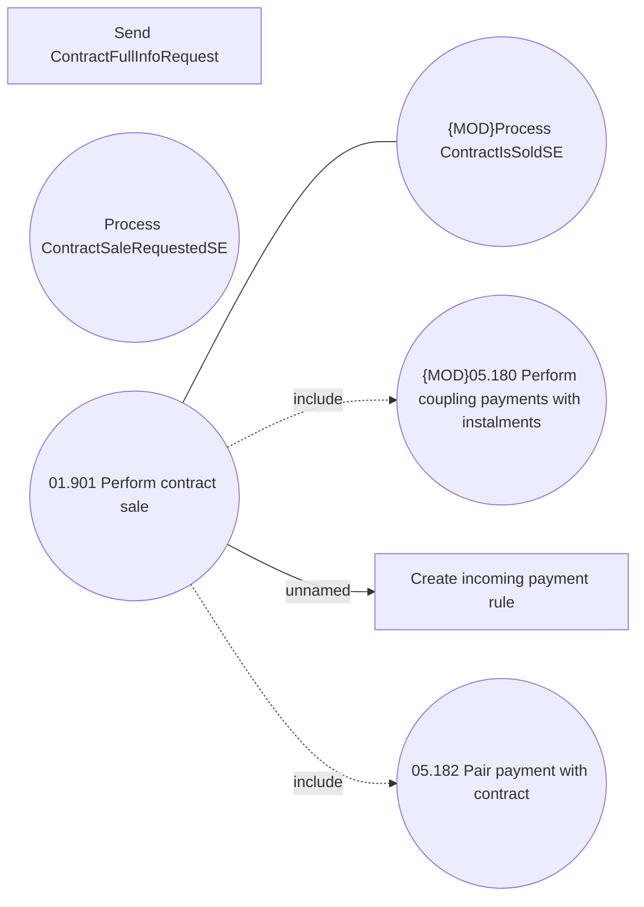

# Contract sale

- **Diagram Type**: Use Case
- **Package**: HomerSelect/BSL/Analysis Model/Contract Management/Contract sale/Use Case model
- **Diagram ID**: 160303
- **Elements**: 7
- **Connectors**: 4

