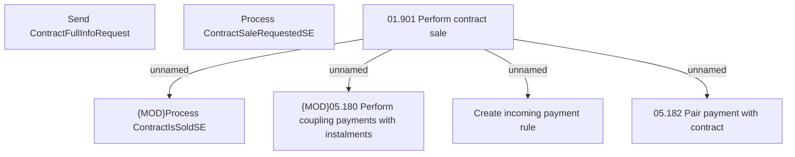

# Contract sale

```mermaid
graph TD
    Send_ContractFullInfoRequest["Send ContractFullInfoRequest"]
    MOD_Process_ContractIsSoldSE["{MOD}Process ContractIsSoldSE"]
    Process_ContractSaleRequestedSE["Process ContractSaleRequestedSE"]
    n_05_182_Pair_payment_with_contract["05.182 Pair payment with contract"]
    Create_incoming_payment_rule["Create incoming payment rule"]
    MOD_05_180_Perform_coupling_payments_with_instalments["{MOD}05.180 Perform coupling payments with instalments"]
    n_01_901_Perform_contract_sale["01.901 Perform contract sale"]
    n_01_901_Perform_contract_sale -->|unnamed| MOD_Process_ContractIsSoldSE
    n_01_901_Perform_contract_sale -->|unnamed| MOD_05_180_Perform_coupling_payments_with_instalments
    n_01_901_Perform_contract_sale -->|unnamed| Create_incoming_payment_rule
    n_01_901_Perform_contract_sale -->|unnamed| n_05_182_Pair_payment_with_contract
```
