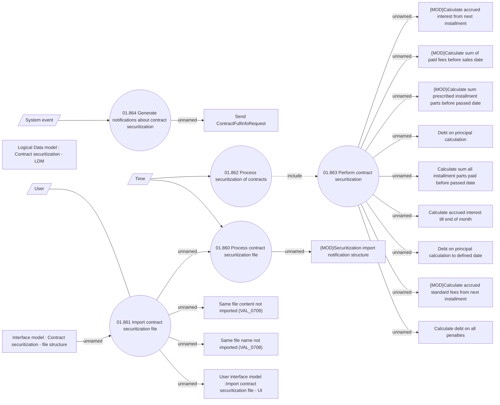

# Contract securitization

- **Diagram Type**: Use Case
- **Package**: HomerSelect/BSL/Analysis Model/Contract Management/Contract securitization/Use case model
- **Diagram ID**: 160305
- **Elements**: 24
- **Connectors**: 21

