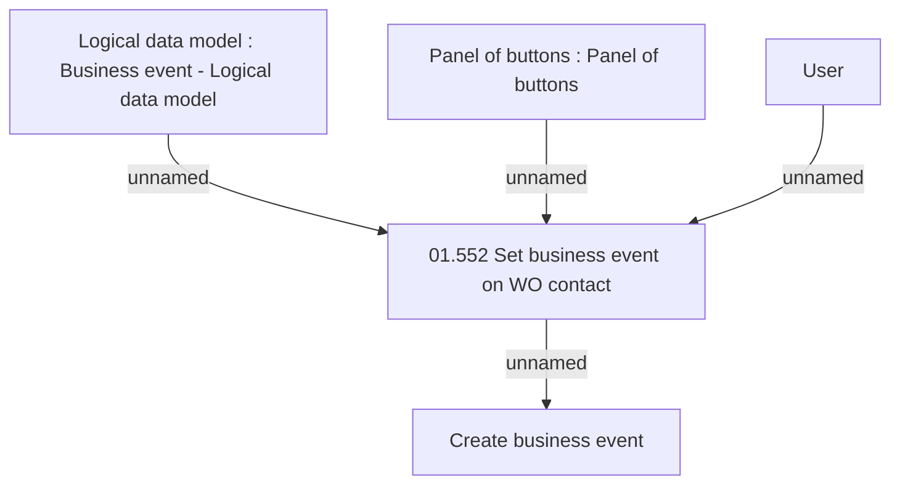

# Setting an Business Event on WO contract

```mermaid
graph TD
    Create_business_event["Create business event"]
    Logical_data_model_Business_event_Logical_data_model["Logical data model : Business event - Logical data model"]
    Panel_of_buttons_Panel_of_buttons["Panel of buttons : Panel of buttons"]
    User["User"]
    n_01_552_Set_business_event_on_WO_contact["01.552 Set business event on WO contact"]
    Logical_data_model_Business_event_Logical_data_model -->|unnamed| n_01_552_Set_business_event_on_WO_contact
    Panel_of_buttons_Panel_of_buttons -->|unnamed| n_01_552_Set_business_event_on_WO_contact
    n_01_552_Set_business_event_on_WO_contact -->|unnamed| Create_business_event
    User -->|unnamed| n_01_552_Set_business_event_on_WO_contact
```
