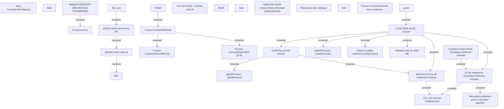

# Write-off CEL contract

```mermaid
graph TD
    Send_ContractFullInfoRequest["Send ContractFullInfoRequest"]
    el_1878685["Note"]
    ProxyConnector["ProxyConnector"]
    diagram_63033335_3990_485f_9A30_770181BFB08D["$diagram://{63033335-3990-485f-9A30-770181BFB08D}"]
    COMA["COMA"]
    BSL_user["BSL user"]
    ADD_Contract_write_off_via_API["{ADD}Contract write-off via API"]
    BSL["BSL"]
    Use_Case_Model_Contract_write_off["Use Case Model : Contract write-off"]
    BOOK["BOOK"]
    MOD_Contract_write_off["{MOD}Contract write-off"]
    el_1878680["Note"]
    Logical_Data_Model_Contract_Write_off_domain_model_obsolete["Logical Data Model :Contract Write-off domain model (obsolete)"]
    Recalculate_debt_catalogue["Recalculate debt catalogue"]
    Process_ContractWrittenOffSE_IS["Process ContractWrittenOffSE [IS]"]
    Process_ContractWrittenOff["Process ContractWrittenOff"]
    el_1878684["Note"]
    Process_ContractWrittenOff_event_notification["Process ContractWrittenOff event notification"]
    Process_ContractWrittenOffSE_CLM["Process ContractWrittenOffSE [CLM]"]
    payOffContract_payOffContract["payOffContract : payOffContract"]
    n_01_502_Pay_off_CEL_contract["01.502 Pay-off CEL contract"]
    writeOffContract_writeOffContract["writeOffContract : writeOffContract"]
    Create_or_update_Amortized_Contract_record["Create or update Amortized Contract record"]
    Validation_rules_for_Write_offs["Validation rules for Write-offs"]
    Loxon["Loxon"]
    n_01_550_Write_off_CEL_contract["01.550 Write-off CEL contract"]
    n_03_150_Regenerate_terminated_installment_schedule["03.150 Regenerate terminated installment schedule"]
    ALG_Get_involved_Installment_part["ALG_Get involved Installment part"]
    Terminated_installment_parts_recalculation_algorithm["Terminated installment parts recalculation algorithm"]
    Example_of_regenerating_Terminated_installment_schedule["Example of regenerating Terminated installment schedule"]
    MOD_03_120_Pay_off_installment_schedule["{MOD}03.120 Pay off installment schedule"]
    COMA["COMA"]
    n_01_550_Write_off_CEL_contract -->|unnamed| writeOffContract_writeOffContract
    diagram_63033335_3990_485f_9A30_770181BFB08D -->|unnamed| ProxyConnector
    BSL_user -->|unnamed| ADD_Contract_write_off_via_API
    MOD_Contract_write_off -->|unnamed| BSL
    ADD_Contract_write_off_via_API -->|unnamed| MOD_Contract_write_off
    n_01_550_Write_off_CEL_contract -->|unnamed| n_01_502_Pay_off_CEL_contract
    n_01_502_Pay_off_CEL_contract -->|unnamed| MOD_03_120_Pay_off_installment_schedule
    n_01_550_Write_off_CEL_contract -->|unnamed| Create_or_update_Amortized_Contract_record
    n_01_550_Write_off_CEL_contract -->|unnamed| Validation_rules_for_Write_offs
    Example_of_regenerating_Terminated_installment_schedule -->|unnamed| n_03_150_Regenerate_terminated_installment_schedule
    n_01_550_Write_off_CEL_contract -->|unnamed| n_03_150_Regenerate_terminated_installment_schedule
    MOD_03_120_Pay_off_installment_schedule -->|unnamed| ALG_Get_involved_Installment_part
    n_03_150_Regenerate_terminated_installment_schedule -->|unnamed| ALG_Get_involved_Installment_part
    n_03_150_Regenerate_terminated_installment_schedule -->|unnamed| Terminated_installment_parts_recalculation_algorithm
    n_01_550_Write_off_CEL_contract -->|unnamed| MOD_03_120_Pay_off_installment_schedule
    n_01_502_Pay_off_CEL_contract -->|unnamed| payOffContract_payOffContract
    Process_ContractWrittenOff -->|unnamed| Process_ContractWrittenOffSE_IS
    Process_ContractWrittenOff -->|unnamed| Process_ContractWrittenOffSE_CLM
    COMA -->|unnamed| Process_ContractWrittenOff
    Loxon -->|unnamed| n_01_550_Write_off_CEL_contract
```
