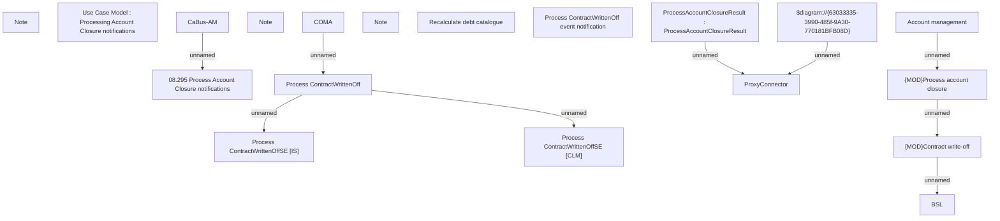

# Write-off REL contract

```mermaid
graph TD
    el_1878649["Note"]
    Use_Case_Model_Processing_Account_Closure_notifications["Use Case Model : Processing Account Closure notifications"]
    n_08_295_Process_Account_Closure_notifications["08.295 Process Account Closure notifications"]
    CaBus_AM["CaBus-AM"]
    el_1878683["Note"]
    COMA["COMA"]
    el_1878680["Note"]
    Recalculate_debt_catalogue["Recalculate debt catalogue"]
    Process_ContractWrittenOffSE_IS["Process ContractWrittenOffSE [IS]"]
    Process_ContractWrittenOff["Process ContractWrittenOff"]
    Process_ContractWrittenOff_event_notification["Process ContractWrittenOff event notification"]
    Process_ContractWrittenOffSE_CLM["Process ContractWrittenOffSE [CLM]"]
    ProxyConnector["ProxyConnector"]
    diagram_63033335_3990_485f_9A30_770181BFB08D["$diagram://{63033335-3990-485f-9A30-770181BFB08D}"]
    ProxyConnector["ProxyConnector"]
    ProcessAccountClosureResult_ProcessAccountClosureResult["ProcessAccountClosureResult : ProcessAccountClosureResult"]
    BSL["BSL"]
    MOD_Process_account_closure["{MOD}Process account closure"]
    Account_management["Account management"]
    MOD_Contract_write_off["{MOD}Contract write-off"]
    COMA["COMA"]
    MOD_Process_account_closure -->|unnamed| MOD_Contract_write_off
    Account_management -->|unnamed| MOD_Process_account_closure
    MOD_Contract_write_off -->|unnamed| BSL
    ProcessAccountClosureResult_ProcessAccountClosureResult -->|unnamed| ProxyConnector
    diagram_63033335_3990_485f_9A30_770181BFB08D -->|unnamed| ProxyConnector
    Process_ContractWrittenOff -->|unnamed| Process_ContractWrittenOffSE_IS
    Process_ContractWrittenOff -->|unnamed| Process_ContractWrittenOffSE_CLM
    COMA -->|unnamed| Process_ContractWrittenOff
    CaBus_AM -->|unnamed| n_08_295_Process_Account_Closure_notifications
```
