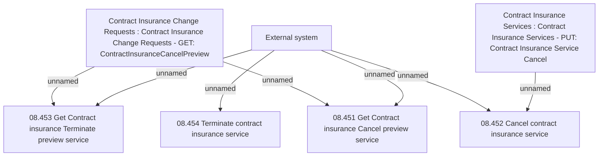

# Contract Insurance Service finishing - Use Case Model

```mermaid
graph TD
    Contract_Insurance_Change_Requests_Contract_Insurance_Change["Contract Insurance Change Requests : Contract Insurance Change Requests - GET: ContractInsuranceTerminatePreview"]
    Contract_Insurance_Services_Contract_Insurance_Services_PUT_["Contract Insurance Services : Contract Insurance Services - PUT: Contract Insurance Service Terminate"]
    n_08_454_Terminate_contract_insurance_service["08.454 Terminate contract insurance service"]
    n_08_453_Get_Contract_insurance_Terminate_preview_service["08.453 Get Contract insurance Terminate preview service"]
    Contract_Insurance_Services_Contract_Insurance_Services_PUT_["Contract Insurance Services : Contract Insurance Services - PUT: Contract Insurance Service Cancel"]
    External_system["External system"]
    Contract_Insurance_Change_Requests_Contract_Insurance_Change["Contract Insurance Change Requests : Contract Insurance Change Requests - GET: ContractInsuranceCancelPreview"]
    n_08_452_Cancel_contract_insurance_service["08.452 Cancel contract insurance service"]
    n_08_451_Get_Contract_insurance_Cancel_preview_service["08.451 Get Contract insurance Cancel preview service"]
    Contract_Insurance_Services_Contract_Insurance_Services_PUT_ -->|unnamed| n_08_452_Cancel_contract_insurance_service
    External_system -->|unnamed| n_08_453_Get_Contract_insurance_Terminate_preview_service
    External_system -->|unnamed| n_08_454_Terminate_contract_insurance_service
    External_system -->|unnamed| n_08_452_Cancel_contract_insurance_service
    External_system -->|unnamed| n_08_451_Get_Contract_insurance_Cancel_preview_service
    Contract_Insurance_Change_Requests_Contract_Insurance_Change -->|unnamed| n_08_453_Get_Contract_insurance_Terminate_preview_service
    Contract_Insurance_Change_Requests_Contract_Insurance_Change -->|unnamed| n_08_451_Get_Contract_insurance_Cancel_preview_service
```
