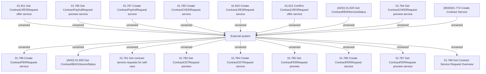

# Contract Service Requests - Use Case Model

```mermaid
graph TD
    ADD_01_830_Get_ContractIBACkSeviceStatus["{ADD} 01.830 Get ContractIBACkSeviceStatus"]
    ADD_01_820_Get_ContractREWServiceStatus["{ADD} 01.820 Get ContractREWServiceStatus"]
    n_01_812_Confirm_ContractLRESRequest_offer_service["01.812 Confirm ContractLRESRequest offer service"]
    n_01_811_Get_ContractLRESRequest_offer_service["01.811 Get ContractLRESRequest offer service"]
    n_01_797_Create_ContractPayholRequest_service["01.797 Create ContractPayholRequest service"]
    n_01_796_Get_ContractPayholRequest_preview_service["01.796 Get ContractPayholRequest preview service"]
    n_01_810_Create_ContractLRESRequest_service["01.810 Create ContractLRESRequest service"]
    n_01_795_Create_ContractCHDDRequest_service["01.795 Create ContractCHDDRequest service"]
    n_01_794_Get_ContractCHDDRequest_preview_service["01.794 Get ContractCHDDRequest preview service"]
    n_01_788_Create_ContractPERRequest_service["01.788 Create ContractPERRequest service"]
    n_01_787_Get_ContractPERRequest_preview_service["01.787 Get ContractPERRequest preview service"]
    MOD_01_774_Create_Contract_Service["{MOD}01.774 Create Contract Service"]
    n_01_786_Create_ContractFERRequest_service["01.786 Create ContractFERRequest service"]
    n_01_785_Get_ContractFERRequest_preview["01.785 Get ContractFERRequest preview"]
    n_01_784_Create_ContractCETRequest_service["01.784 Create ContractCETRequest service"]
    n_01_783_Get_ContractCETRequest_preview["01.783 Get ContractCETRequest preview"]
    n_01_768_Get_Contract_Service_Request_Overview["01.768 Get Contract Service Request Overview"]
    External_system["External system"]
    n_01_761_Get_contract_service_requests_for_self_care["01.761 Get contract service requests for self-care"]
    n_01_811_Get_ContractLRESRequest_offer_service -->|unnamed| External_system
    n_01_796_Get_ContractPayholRequest_preview_service -->|unnamed| External_system
    n_01_797_Create_ContractPayholRequest_service -->|unnamed| External_system
    n_01_795_Create_ContractCHDDRequest_service -->|unnamed| External_system
    n_01_810_Create_ContractLRESRequest_service -->|unnamed| External_system
    n_01_812_Confirm_ContractLRESRequest_offer_service -->|unnamed| External_system
    ADD_01_820_Get_ContractREWServiceStatus -->|unnamed| External_system
    n_01_794_Get_ContractCHDDRequest_preview_service -->|unnamed| External_system
    External_system -->|unnamed| n_01_788_Create_ContractPERRequest_service
    External_system -->|unnamed| ADD_01_830_Get_ContractIBACkSeviceStatus
    External_system -->|unnamed| n_01_761_Get_contract_service_requests_for_self_care
    External_system -->|unnamed| n_01_783_Get_ContractCETRequest_preview
    External_system -->|unnamed| n_01_784_Create_ContractCETRequest_service
    External_system -->|unnamed| n_01_785_Get_ContractFERRequest_preview
    External_system -->|unnamed| n_01_786_Create_ContractFERRequest_service
    External_system -->|unnamed| n_01_787_Get_ContractPERRequest_preview_service
    External_system -->|unnamed| n_01_768_Get_Contract_Service_Request_Overview
    MOD_01_774_Create_Contract_Service -->|unnamed| External_system
```
