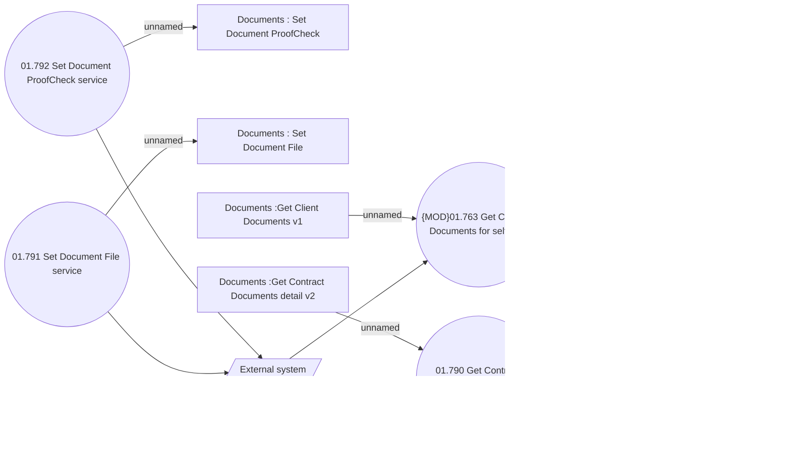

# Contract document services

- **Diagram Type**: Use Case
- **Package**: HomerSelect/BSL/Analysis Model/Contract Management/Customer Self-Care API/Use Case Model
- **Diagram ID**: 163432
- **Elements**: 10
- **Connectors**: 9

