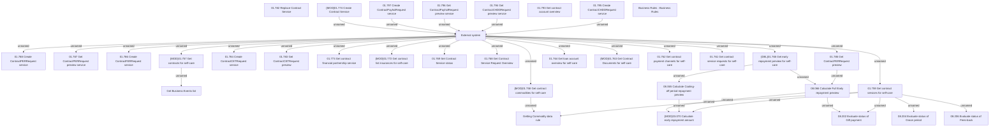

# Customer Self-Care API - Use Case Model

```mermaid
graph TD
    MOD_03_070_Calculate_early_repayment_amount["{MOD}03.070 Calculate early repayment amount"]
    n_01_782_Replace_Contract_Service["01.782 Replace Contract Service"]
    n_01_788_Create_ContractPERRequest_service["01.788 Create ContractPERRequest service"]
    n_01_787_Get_ContractPERRequest_preview_service["01.787 Get ContractPERRequest preview service"]
    n_01_786_Create_ContractFERRequest_service["01.786 Create ContractFERRequest service"]
    n_01_785_Get_ContractFERRequest_preview["01.785 Get ContractFERRequest preview"]
    n_01_784_Create_ContractCETRequest_service["01.784 Create ContractCETRequest service"]
    n_01_783_Get_ContractCETRequest_preview["01.783 Get ContractCETRequest preview"]
    n_01_796_Get_ContractPayholRequest_preview_service["01.796 Get ContractPayholRequest preview service"]
    n_01_797_Create_ContractPayholRequest_service["01.797 Create ContractPayholRequest service"]
    n_01_794_Get_ContractCHDDRequest_preview_service["01.794 Get ContractCHDDRequest preview service"]
    n_01_795_Create_ContractCHDDRequest_service["01.795 Create ContractCHDDRequest service"]
    n_01_793_Get_contract_account_overview["01.793 Get contract account overview"]
    MOD_01_774_Create_Contract_Service["{MOD}01.774 Create Contract Service"]
    Get_Business_Events_list["Get Business Events list"]
    n_01_773_Get_contract_financial_partnership_service["01.773 Get contract financial partnership service"]
    MOD_01_772_Get_contract_list_insurances_for_self_care["{MOD}01.772 Get contract list insurances for self-care"]
    n_01_769_Set_Contract_Service_status["01.769 Set Contract Service status"]
    Getting_Commodity_data_rule["Getting Commodity data rule"]
    n_01_768_Get_Contract_Service_Request_Overview["01.768 Get Contract Service Request Overview"]
    n_08_066_Calculate_Full_Early_repayment_preview["08.066 Calculate Full Early repayment preview"]
    n_08_065_Calculate_Cooling_off_period_repayment_preview["08.065 Calculate Cooling-off period repayment preview"]
    DEL_01_765_Get_early_repayment_preview_for_self_care["{DEL}01.765 Get early repayment preview for self-care"]
    n_08_206_Evaluate_status_of_Fees_back["08.206 Evaluate status of Fees-back"]
    n_08_204_Evaluate_status_of_Grace_period["08.204 Evaluate status of Grace period"]
    n_08_202_Evaluate_status_of_Gift_payment["08.202 Evaluate status of Gift payment"]
    Business_Rules_Business_Rules["Business Rules : Business Rules"]
    External_system["External system"]
    n_01_764_Get_loan_account_overview_for_self_care["01.764 Get loan account overview for self-care"]
    MOD_01_763_Get_Contract_Documents_for_self_care["{MOD}01.763 Get Contract Documents for self-care"]
    n_01_762_Get_contract_payment_channels_for_self_care["01.762 Get contract payment channels for self-care"]
    n_01_761_Get_contract_service_requests_for_self_care["01.761 Get contract service requests for self-care"]
    n_01_759_Get_contract_services_for_self_care["01.759 Get contract services for self-care"]
    MOD_01_758_Get_contract_commodities_for_self_care["{MOD}01.758 Get contract commodities for self-care"]
    MOD_01_757_Get_contracts_for_self_care["{MOD}01.757 Get contracts for self-care"]
    n_01_785_Get_ContractFERRequest_preview -->|unnamed| n_08_066_Calculate_Full_Early_repayment_preview
    n_01_759_Get_contract_services_for_self_care -->|unnamed| Getting_Commodity_data_rule
    MOD_01_758_Get_contract_commodities_for_self_care -->|unnamed| Getting_Commodity_data_rule
    MOD_01_757_Get_contracts_for_self_care -->|unnamed| Get_Business_Events_list
    n_01_759_Get_contract_services_for_self_care -->|unnamed| MOD_03_070_Calculate_early_repayment_amount
    n_08_065_Calculate_Cooling_off_period_repayment_preview -->|unnamed| MOD_03_070_Calculate_early_repayment_amount
    n_01_795_Create_ContractCHDDRequest_service -->|unnamed| External_system
    DEL_01_765_Get_early_repayment_preview_for_self_care -->|unnamed| n_08_066_Calculate_Full_Early_repayment_preview
    n_01_794_Get_ContractCHDDRequest_preview_service -->|unnamed| External_system
    DEL_01_765_Get_early_repayment_preview_for_self_care -->|unnamed| n_08_065_Calculate_Cooling_off_period_repayment_preview
    n_01_796_Get_ContractPayholRequest_preview_service -->|unnamed| External_system
    n_01_759_Get_contract_services_for_self_care -->|unnamed| n_08_202_Evaluate_status_of_Gift_payment
    n_01_759_Get_contract_services_for_self_care -->|unnamed| n_08_204_Evaluate_status_of_Grace_period
    n_01_759_Get_contract_services_for_self_care -->|unnamed| n_08_206_Evaluate_status_of_Fees_back
    n_01_797_Create_ContractPayholRequest_service -->|unnamed| External_system
    External_system -->|unnamed| n_01_773_Get_contract_financial_partnership_service
    External_system -->|unnamed| n_01_788_Create_ContractPERRequest_service
    External_system -->|unnamed| MOD_01_772_Get_contract_list_insurances_for_self_care
    External_system -->|unnamed| MOD_01_758_Get_contract_commodities_for_self_care
    External_system -->|unnamed| MOD_01_763_Get_Contract_Documents_for_self_care
    External_system -->|unnamed| n_01_761_Get_contract_service_requests_for_self_care
    External_system -->|unnamed| MOD_01_757_Get_contracts_for_self_care
    External_system -->|unnamed| n_01_783_Get_ContractCETRequest_preview
    External_system -->|unnamed| n_01_784_Create_ContractCETRequest_service
    External_system -->|unnamed| n_01_785_Get_ContractFERRequest_preview
    External_system -->|unnamed| n_01_786_Create_ContractFERRequest_service
    External_system -->|unnamed| n_01_787_Get_ContractPERRequest_preview_service
    External_system -->|unnamed| n_01_764_Get_loan_account_overview_for_self_care
    External_system -->|unnamed| n_01_768_Get_Contract_Service_Request_Overview
    External_system -->|unnamed| DEL_01_765_Get_early_repayment_preview_for_self_care
    External_system -->|unnamed| n_01_759_Get_contract_services_for_self_care
    External_system -->|unnamed| n_01_762_Get_contract_payment_channels_for_self_care
    n_08_066_Calculate_Full_Early_repayment_preview -->|unnamed| n_08_202_Evaluate_status_of_Gift_payment
    n_08_066_Calculate_Full_Early_repayment_preview -->|unnamed| MOD_03_070_Calculate_early_repayment_amount
    External_system -->|unnamed| n_01_769_Set_Contract_Service_status
    MOD_01_774_Create_Contract_Service -->|unnamed| External_system
```
