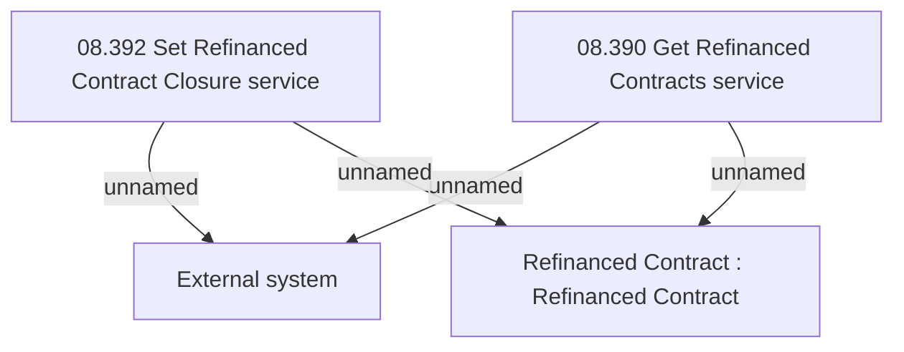

# Refinanced Contract

```mermaid
graph TD
    Refinanced_Contract_Refinanced_Contract["Refinanced Contract : Refinanced Contract"]
    n_08_392_Set_Refinanced_Contract_Closure_service["08.392 Set Refinanced Contract Closure service"]
    n_08_390_Get_Refinanced_Contracts_service["08.390 Get Refinanced Contracts service"]
    External_system["External system"]
    n_08_392_Set_Refinanced_Contract_Closure_service -->|unnamed| External_system
    n_08_390_Get_Refinanced_Contracts_service -->|unnamed| External_system
    n_08_390_Get_Refinanced_Contracts_service -->|unnamed| Refinanced_Contract_Refinanced_Contract
    n_08_392_Set_Refinanced_Contract_Closure_service -->|unnamed| Refinanced_Contract_Refinanced_Contract
```
