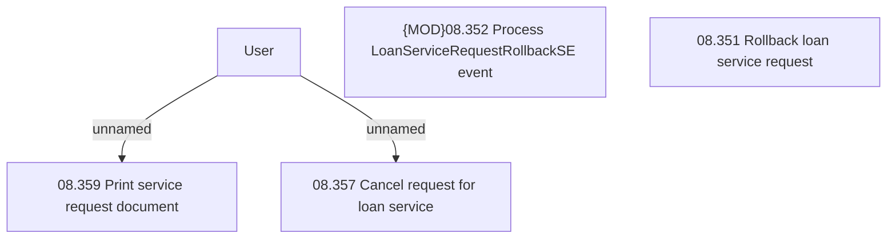

# Loan service request management

```mermaid
graph TD
    n_08_357_Cancel_request_for_loan_service["08.357 Cancel request for loan service"]
    User["User"]
    n_08_359_Print_service_request_document["08.359 Print service request document"]
    MOD_08_352_Process_LoanServiceRequestRollbackSE_event["{MOD}08.352 Process LoanServiceRequestRollbackSE event"]
    n_08_351_Rollback_loan_service_request["08.351 Rollback loan service request"]
    User -->|unnamed| n_08_359_Print_service_request_document
    User -->|unnamed| n_08_357_Cancel_request_for_loan_service
```
