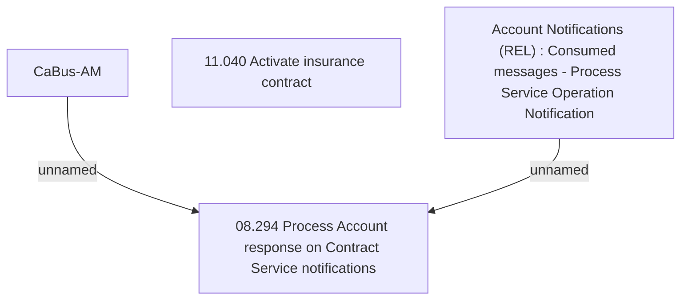

# Processing Account responses on Service changes

```mermaid
graph TD
    Account_Notifications_REL_Consumed_messages_Process_Service_["Account Notifications (REL) : Consumed messages - Process Service Operation Notification"]
    n_08_294_Process_Account_response_on_Contract_Service_notifi["08.294 Process Account response on Contract Service notifications"]
    n_11_040_Activate_insurance_contract["11.040 Activate insurance contract"]
    CaBus_AM["CaBus-AM"]
    CaBus_AM -->|unnamed| n_08_294_Process_Account_response_on_Contract_Service_notifi
    Account_Notifications_REL_Consumed_messages_Process_Service_ -->|unnamed| n_08_294_Process_Account_response_on_Contract_Service_notifi
```
