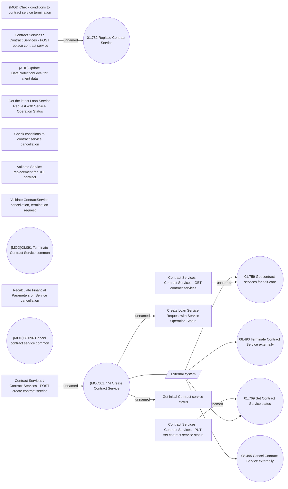

# Service - Contract Service management via API

- **Diagram Type**: Use Case
- **Package**: HomerSelect/BSL/Analysis Model/Contract Management/Loan Service Processing/COMMON for Loan Services/Use Case Model
- **Diagram ID**: 164580
- **Elements**: 22
- **Connectors**: 11

