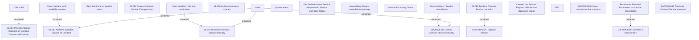

# Service - Contract Service management via UI

```mermaid
graph TD
    Get_Tariff_Items_used_for_a_Service_fees["Get Tariff Items used for a Service fees"]
    n_08_294_Process_Account_response_on_Contract_Service_notifi["08.294 Process Account response on Contract Service notifications"]
    CaBus_AM["CaBus-AM"]
    User_Interface_Add_available_services["User Interface :Add available services"]
    Get_initial_Contract_service_status["Get initial Contract service status"]
    n_08_080_Add_new_available_Service_on_Contract["08.080 Add new available Service on Contract"]
    n_08_292_Process_Contract_Service_Change_event["08.292 Process Contract Service Change event"]
    User["User"]
    n_11_040_Activate_insurance_contract["11.040 Activate insurance contract"]
    MOD_08_095_Cancel_contract_service_manually["{MOD}08.095 Cancel contract service manually"]
    n_08_085_Replace_Contract_Service_manually["08.085 Replace Contract Service manually"]
    System_event["System event"]
    Get_the_latest_Loan_Service_Request_with_Service_Operation_S["Get the latest Loan Service Request with Service Operation Status"]
    Assembling_Service_cancellation_message["Assembling Service cancellation message"]
    Service_Exclusivity_Check["Service Exclusivity Check"]
    n_08_090_Terminate_Contract_Service_manually["08.090 Terminate Contract Service manually"]
    User_Interface_Service_termination["User Interface : Service termination"]
    Recalculate_Financial_Parameters_on_Service_cancellation["Recalculate Financial Parameters on Service cancellation"]
    Create_Loan_Service_Request_with_Service_Operation_Status["Create Loan Service Request with Service Operation Status"]
    BSL["BSL"]
    MOD_08_096_Cancel_contract_service_common["{MOD}08.096 Cancel contract service common"]
    User_Interface_Replace_service["User Interface : Replace service"]
    User_Interface_Service_cancellation["User Interface : Service cancellation"]
    MOD_08_091_Terminate_Contract_Service_common["{MOD}08.091 Terminate Contract Service common"]
    User_Interface_Service_cancellation -->|unnamed| MOD_08_095_Cancel_contract_service_manually
    n_08_085_Replace_Contract_Service_manually -->|unnamed| User_Interface_Replace_service
    Recalculate_Financial_Parameters_on_Service_cancellation -->|unnamed| Get_Tariff_Items_used_for_a_Service_fees
    User_Interface_Service_termination -->|unnamed| n_08_090_Terminate_Contract_Service_manually
    User_Interface_Add_available_services -->|unnamed| n_08_080_Add_new_available_Service_on_Contract
    User -->|unnamed| n_08_090_Terminate_Contract_Service_manually
    User -->|unnamed| MOD_08_095_Cancel_contract_service_manually
    CaBus_AM -->|unnamed| n_08_294_Process_Account_response_on_Contract_Service_notifi
    User -->|unnamed| n_08_080_Add_new_available_Service_on_Contract
```
